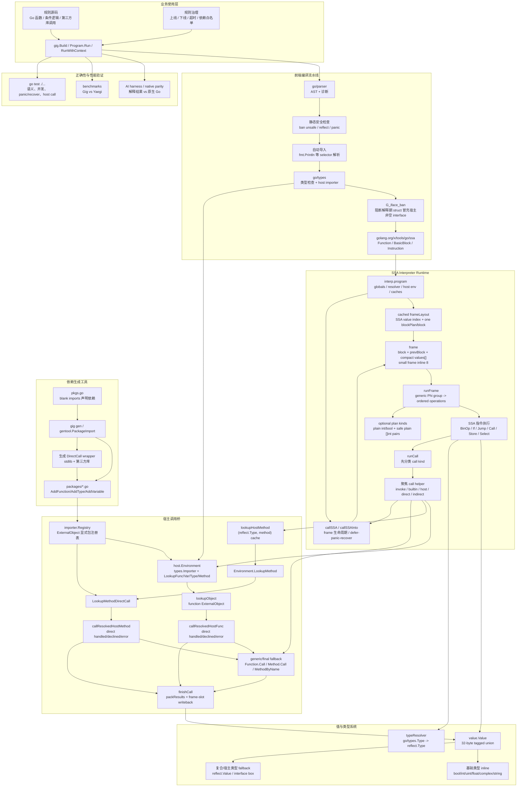
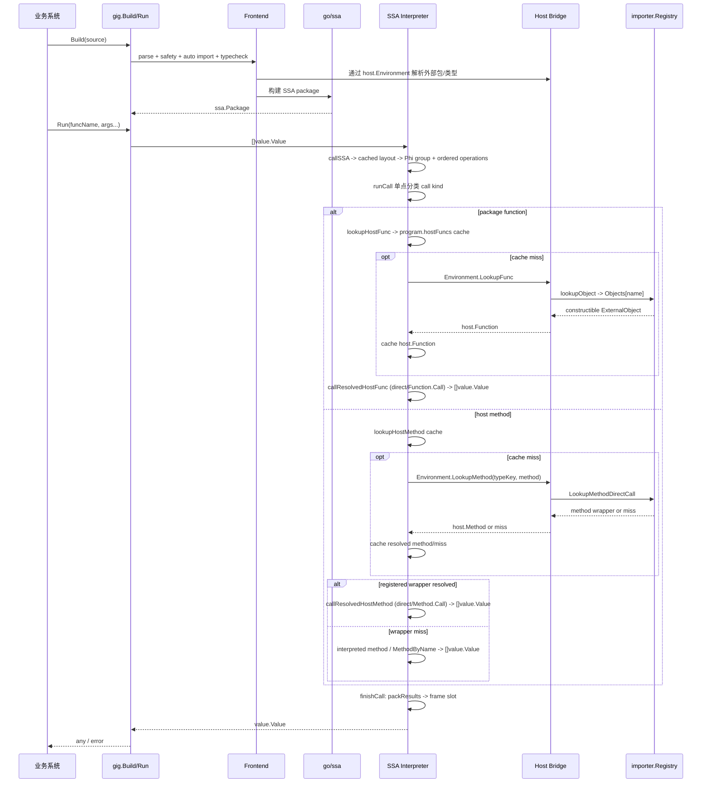

# Gig 项目总览：基于 Go SSA 的规则解释执行引擎

本文面向项目介绍、技术分享和简历材料，概括 Gig 当前架构、核心创新点、性能结论和可直接使用的简历表述。

## 项目定位

Gig 是一个可嵌入 Go 应用的动态规则解释执行引擎。它面向活动平台、配置化策略、实验规则、准入条件等“业务变化快、硬编码发布慢、模板函数扩展成本高”的场景，让规则仍然以 Go 语法编写，同时由宿主系统统一治理依赖、超时、安全边界、测试和发布下线流程。

当前实现已经从早期“SSA -> 字节码 -> 栈式 VM”演进为更直接的 SSA interpreter：

```text
Go Source -> go/parser -> go/types -> go/ssa -> direct SSA interpreter
```

这样减少一层自定义 IR/bytecode 维护成本，同时用共享的 cached layout、每次调用
唯一一段紧凑 Value 存储、单一有序 block plan 和 DirectCall wrapper 保留经过
测量的热点优化。

## 详细架构图


```mermaid
flowchart TB
    subgraph UseCase["业务使用层"]
        Rule["规则源码<br/>Go 函数 / 条件逻辑 / 第三方库调用"]
        API["gig.Build / Program.Run / RunWithContext"]
        Ops["规则治理<br/>上线 / 下线 / 超时 / 依赖白名单"]
    end

    subgraph Frontend["前端编译流水线"]
        Parse["go/parser<br/>AST + 诊断"]
        Safety["静态安全检查<br/>ban unsafe / reflect / panic"]
        AutoImport["自动导入<br/>fmt.Println 等 selector 解析"]
        Typecheck["go/types<br/>类型检查 + host importer"]
        IfaceBan["G_iface_ban<br/>阻断解释期 struct 冒充宿主非空 interface"]
        SSA["golang.org/x/tools/go/ssa<br/>Function / BasicBlock / Instruction"]
    end

    subgraph Runtime["SSA Interpreter Runtime"]
        Program["interp.program<br/>globals / resolver / host env / caches"]
        Layout["cached frameLayout<br/>SSA value index + one blockPlan/block"]
        CallSSA["callSSA / callSSAInto<br/>frame 生命周期 / defer-panic-recover"]
        Frame["frame<br/>block + prevBlock + compact values[]<br/>small frame inline 8"]
        RunFrame["runFrame<br/>generic Phi group -> ordered operations"]
        OpsInterp["SSA 指令执行<br/>BinOp / If / Jump / Call / Store / Select"]
        CallClass["runCall<br/>先分类 call kind"]
        CallHelper["聚焦 call helper<br/>invoke / builtin / host / direct / indirect"]
        PlanKinds["optional plan kinds<br/>plain int/bool + safe plain []int pairs"]
    end

    subgraph ValueSystem["值与类型系统"]
        Value["value.Value<br/>32-byte tagged union"]
        Primitive["基础类型 inline<br/>bool/int/uint/float/complex/string"]
        ReflectBox["复合/宿主类型 fallback<br/>reflect.Value / interface box"]
        Resolver["typeResolver<br/>go/types.Type -> reflect.Type"]
    end

    subgraph HostBridge["宿主调用桥"]
        Env["host.Environment<br/>types.Importer + LookupFunc/Var/Type/Method"]
        Registry["importer.Registry<br/>ExternalObject 显式包注册表"]
        ObjectLookup["lookupObject<br/>function ExternalObject"]
        FuncResolved["callResolvedHostFunc<br/>direct handled/declined/error"]
        MethodCache["lookupHostMethod<br/>(reflect.Type, method) cache"]
        MethodEnv["Environment.LookupMethod"]
        MethodDirect["LookupMethodDirectCall"]
        MethodResolved["callResolvedHostMethod<br/>direct handled/declined/error"]
        ReflectCall["generic/final fallback<br/>Function.Call / Method.Call / MethodByName"]
        Finish["finishCall<br/>packResults + frame-slot writeback"]
    end

    subgraph GenTool["依赖生成工具"]
        Pkgs["pkgs.go<br/>blank imports 声明依赖"]
        Gen["gig gen / gentool.PackageImport"]
        Generated["packages/*.go<br/>AddFunction/AddType/AddVariable"]
        Wrappers["生成 DirectCall wrapper<br/>stdlib + 第三方库"]
    end

    subgraph Quality["正确性与性能验证"]
        NativeParity["AI harness / native parity<br/>解释结果 vs 原生 Go"]
        Bench["benchmarks<br/>Gig vs Yaegi"]
        Tests["go test ./...<br/>语义、并发、panic/recover、host call"]
    end

    Rule --> API --> Parse --> Safety --> AutoImport --> Typecheck --> IfaceBan --> SSA
    Ops --> API

    SSA --> Program
    Program --> Layout --> Frame
    Program --> CallSSA --> Frame --> RunFrame --> OpsInterp
    RunFrame --> PlanKinds

    OpsInterp --> Value
    Value --> Primitive
    Value --> ReflectBox
    OpsInterp --> Resolver
    OpsInterp --> CallClass --> CallHelper

    Typecheck --> Env
    Pkgs --> Gen --> Generated --> Registry
    Gen --> Wrappers --> Generated
    Registry --> Env

    CallHelper --> Env
    Env --> ObjectLookup --> FuncResolved
    CallHelper --> MethodCache --> MethodEnv --> MethodDirect --> MethodResolved
    Registry --> MethodDirect
    CallHelper --> ReflectCall
    CallHelper --> CallSSA
    FuncResolved --> ReflectCall
    MethodResolved --> ReflectCall
    FuncResolved --> Finish
    MethodResolved --> Finish
    ReflectCall --> Finish
    Finish --> Value

    API --> NativeParity
    API --> Bench
    API --> Tests
```

## 执行数据流


```mermaid
sequenceDiagram
    participant User as 业务系统
    participant Gig as gig.Build/Run
    participant FE as Frontend
    participant SSA as go/ssa
    participant I as SSA Interpreter
    participant H as Host Bridge
    participant R as importer.Registry

    User->>Gig: Build(source)
    Gig->>FE: parse + safety + auto import + typecheck
    FE->>H: 通过 host.Environment 解析外部包/类型
    FE->>SSA: 构建 SSA package
    SSA-->>Gig: ssa.Package

    User->>Gig: Run(funcName, args...)
    Gig->>I: []value.Value
    I->>I: callSSA -> cached layout -> Phi group + ordered operations
    I->>I: runCall 单点分类 call kind
    alt package function
        I->>I: lookupHostFunc -> program.hostFuncs cache
        opt cache miss
            I->>H: Environment.LookupFunc
            H->>R: lookupObject -> Objects[name]
            R-->>H: constructible ExternalObject
            H-->>I: host.Function
            I->>I: cache host.Function
        end
        I->>I: callResolvedHostFunc (direct/Function.Call) -> []value.Value
    else host method
        I->>I: lookupHostMethod cache
        opt cache miss
            I->>H: Environment.LookupMethod(typeKey, method)
            H->>R: LookupMethodDirectCall
            R-->>H: method wrapper or miss
            H-->>I: host.Method or miss
            I->>I: cache resolved method/miss
        end
        alt registered wrapper resolved
            I->>I: callResolvedHostMethod (direct/Method.Call) -> []value.Value
        else wrapper miss
            I->>I: interpreted method / MethodByName -> []value.Value
        end
    end
    I->>I: finishCall: packResults -> frame slot
    I-->>Gig: value.Value
    Gig-->>User: any / error
```

## 核心创新点

1. **用 Go 官方前端保留开发体验，而不是自造 DSL。** 规则作者写 Go 函数，Gig 复用 `go/parser`、`go/types`、`go/ssa` 获取语法、类型和控制流语义，避免表达式 DSL 后续不断补语法、补类型系统。

2. **直接解释 SSA，降低自定义 VM 维护面。** 早期栈式 VM 已验证执行模型，但当前实现删除了自定义 bytecode/opcode 层，直接以 `ssa.BasicBlock` 和 `ssa.Instruction` 为执行对象；复杂 Go 语义如 Phi、闭包、defer/panic/recover、goroutine/channel/select 更贴近官方 IR。

3. **在同一执行模型里分层，而不是维护平行引擎。** 每个函数只构建一次 immutable `frameLayout.index`；每次调用只拥有一段紧凑 `[]value.Value`，8 项以内内联在 frame 分配中，更大 frame 使用普通 slice。package global 直接保存 `value.Value`；闭包以 `[]value.Value` 快照 capture，地址值仍共享 pointee。每个 block 只有一条有序 operation list：通用 entry 走 `visitInstr`，plain `int`/`bool` 与可证明安全的相邻 plain `[]int` load/store pair 才使用可选 plan kind。Phi 在块入口通用地先暂存再提交，命名 slice、逃逸地址和其它形态继续走 reflect fallback。没有 per-invocation 的 SSA-value-to-frame-slot lookup map、frame pool 或第二套执行引擎；planned `Range`/`Next` 仍使用 `iters` side table 保存 iterator control state。

4. **一次分类、聚焦 helper 的调用路径。** `runCall` 先在唯一分类点区分 interface、builtin、host、直接解释和间接/reflect 调用，再选择对应 helper。直接解释调用由调用方持有单元素存储：`oneArg [1]value.Value` 与 `oneResult value.Value` 都留在栈上；`callSSAInto` 通过不会返回的 `*value.Value` sink 写入单结果，不返回 aliasing slice。多参数、多结果以及 host/reflect fallback 使用普通 slice。需要打包的 helper 最后进入 `finishCall`：`packResults` 只负责把 0/1/N 元组打包成一个 `Value`，frame-slot writeback 由 `finishCall` 完成。这里没有 scratch pool 或第二套 dispatcher。Package function/variable/constant/type 仍通过 `registryBridge.lookupObject` 从一个 `ExternalObject` 取得值、kind、类型元数据和可选 DirectCall；method wrapper 走独立的 `lookupHostMethod` cache → `Environment.LookupMethod` → `LookupMethodDirectCall` 流程。`callResolvedHostFunc` 与 `callResolvedHostMethod` 各自在单一入口处理 direct handled/declined/error 和 generic call。

5. **宿主接口边界前置治理。** 对“解释期 struct 传给宿主非空 interface”这种需要动态合成 Go 类型的高风险场景，Gig 在前端用 G_iface_ban 给出确定性错误，而不是运行期隐式失败或不完整模拟。

6. **AI harness 驱动语义回归。** 测试体系把解释执行结果与原生 Go 执行结果对比，用来验证 AI 生成代码、解释器语义和外部包桥接的一致性，降低规则引擎演进中的回归风险。

7. **从业务治理闭环出发设计。** 规则不是“能跑代码”即可，还需要依赖声明、超时取消、panic 策略、安全导入、发布下线、回归验证和性能可观测；这些能力被放在 `gig.Build`、`RunWithContext`、registry、gentool 和测试链路中统一管理。

## 最新性能快照

紧凑 Value frame 的验收环境为 Apple M3 Pro、Go `1.26.3`、darwin/arm64。
`BenchmarkGig_Fib25` 的最终 gate 使用 `-benchmem -count=7` 中位数；代表性集合
使用五样本中位数。这里比较的是同一版本 Gig 的执行模型演进，不是新的
Gig/Yaegi 横向测量。

| 集合 | 数量 | 重构后 / 重构前 `ns/op` | 结论 |
| --- | ---: | ---: | --- |
| root `tests` interpreter workloads | 8 | `0.630x`–`1.450x` | 全部低于 `3.0x` |
| `benchmarks` core interpreter workloads | 5 | `0.665x`–`1.485x` | 全部低于 `3.0x` |
| `benchmarks` external-call workloads | 4 | `1.015x`–`1.115x` | 全部低于 `3.0x` |
| **总计** | **17** | worst `1.485011x` | **全部 PASS** |

七样本 `Fib25` gate 的最终中位数为 `51,841,788 ns/op`、
`100,999,547 B/op`、`242,793 allocs/op`；相对 fresh 设计基线分别改善
65.48%、61.76% 和 80.00%，三项 gate 全部通过。17 项代表性 sweep 中上限占用
最高的是 `benchmarks/ArithSum`，仍只使用精确 `3.0x` 上限的 49.5004%。当前
`ExtCallReflect`、`ExtCallMethod`、`ExtCallMixed` 实际命中注册的
`DirectMethod` wrapper，因此外部调用比率衡量的是统一 host-dispatch 路径，
不是纯 raw-reflection method fallback。17 项的逐项耗时、分配变化和硬上限见
`PERFORMANCE_OPTIMIZATION_2026-06_CN.md`。

## 简历更新建议

### 推荐标题

`Gig - 基于 Go SSA 的动态规则解释执行引擎 | Go / SSA / Interpreter / DirectCall / 规则引擎 / GitHub`

不建议继续把当前版本主标题写成“基于栈式 VM”。如果要体现演进过程，可以在面试时说明：早期版本采用栈式 VM，后续重构为直接 SSA interpreter，降低自定义 bytecode 维护成本并提升 Go 语义覆盖。

### 推荐 bullets

- 主导设计并落地兼容 Go 语法的动态规则解释执行引擎，面向活动平台规则高频变更、外部条件接入成本高的问题，以 `go/parser`、`go/types`、`go/ssa` 构建规则编译链路，替代硬编码和模板函数扩展模式，统一规则接入、发布、下线与超时治理。
- 设计直接 SSA interpreter 执行模型，覆盖控制流、闭包、多返回值、defer/panic/recover、goroutine/channel/select、宿主方法调用等 Go 语义；以共享 immutable layout、每次调用唯一的紧凑 Value array、通用 staged Phi 和单一有序 block plan 降低概念分支，并仅为 plain `int`/`bool` 与安全 plain `[]int` pair 保留同计划内的可选优化。
- 实现标准库与第三方 Go 包的生成式接入工具 `gig gen`，自动生成包注册代码和 DirectCall wrapper，支持多返回值与 variadic 参数拆包；外部对象一次解析后经统一 resolved host-call path 选择 direct/generic 调用，四项相关 workload 为原始记录的 `1.015x`–`1.115x`。
- 构建可治理的宿主边界与安全模型：显式 registry 管理外部依赖，默认禁止 `unsafe`、`reflect`、`panic`，通过 G_iface_ban 阻断解释期类型冒充宿主非空 interface，并支持 `context.Context` 取消以满足在线规则执行的超时控制。
- 构建基于 go:embed/AI harness 的语义回归流程，自动对比解释执行结果与原生 Go 执行结果，覆盖 AI 生成规则、外部包调用和解释器核心语义，降低规则引擎迭代中的回归风险。
- 项目已接入活动平台约 10 个活动条件，将外部条件接入周期由数天缩短至约 30 分钟；紧凑 Value frame 将 `Fib25` 的耗时、字节和分配数相对 fresh 设计基线分别降低 65.48%、61.76% 和 80.00%，17 项 workload 全部控制在精确 `3.0x` 预算内，验证了“Go 语法 + 可控解释执行 + 生成式宿主桥”的工程可行性。

### 更短版本

- 主导实现基于 Go SSA 的动态规则解释执行引擎，复用 Go 官方 parser/typechecker/SSA 保留 Go 开发体验，替代硬编码规则和模板函数扩展模式，将活动条件接入周期由数天缩短至约 30 分钟。
- 设计直接 SSA interpreter、typed Value、cached frame layout、compact per-call value storage、ordered block plan、DirectCall host bridge 等核心机制，支持控制流、闭包、多返回值、panic/recover、goroutine/channel/select 和第三方库调用。
- 实现 `gig gen` 生成式外部包接入，自动生成标准库/第三方库注册代码与 DirectCall wrapper，并把一次对象解析、direct/generic 选择和 0/1/N 结果打包收敛到单一宿主调用路径。
- 建立 AI harness/native parity 测试流程，自动对比解释执行与原生 Go 结果，保障 AI 生成规则和解释器语义一致性。
