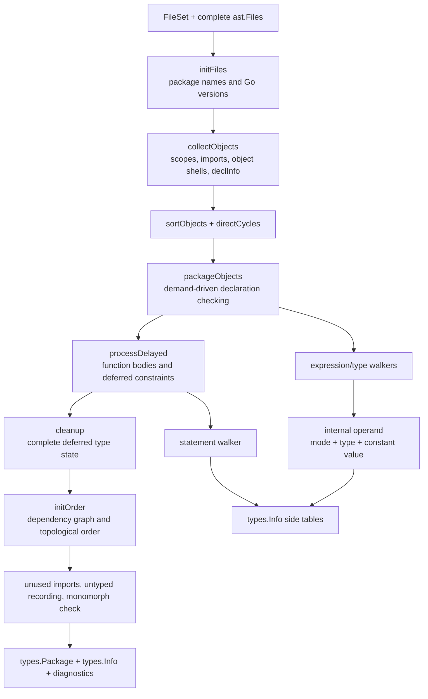

# Studying `go/types`: Semantic Analysis by AST Tree-Walking

This guide is a source-directed curriculum for understanding how Go 1.26.3's
`go/types` package turns a fully parsed package AST into semantic information.
It assumes that scanning and parsing are already familiar: the input is a
`token.FileSet` plus one or more complete `*ast.File` trees.

The goal is not merely to learn the exported `go/types` API. By the end, you
should be able to open an AST node, predict which checker routine handles it,
follow name lookup and type propagation through the checker, and explain which
`types.Info` entries are produced.

For a stage-by-stage account of the complete `Checker.checkFiles` control flow,
use the companion [Go 1.26.3 checker passes manual](GO_TYPES_CHECKER_PASSES.md).

## Version and source convention

This curriculum follows the locally installed Go 1.26.3 source at:

```text
/opt/homebrew/Cellar/go/1.26.3/libexec/src/go/types
```

Most `go/types` implementation files are generated from
`cmd/compile/internal/types2`. Study the `go/types` copy here because it works
directly with `go/ast`, `go/token`, and `types.Info`, which are the APIs used by
source analysis tools. Internal implementation details may change in later Go
versions; the exported semantic model is much more stable.

The main pipeline entry is
[`Checker.checkFiles`](/opt/homebrew/Cellar/go/1.26.3/libexec/src/go/types/check.go#L499).
Keep that function open throughout the curriculum.

## Learning outcomes

After completing the guide, you should be able to explain all of the following:

1. Why `go/types` first creates declaration objects with incomplete types and
   checks those objects later.
2. The exact difference among an AST identifier, a `types.Object`, a
   `types.Type`, a `types.Scope`, and an internal `operand`.
3. Why imports belong to file scopes while ordinary top-level declarations
   belong directly to the package scope.
4. How an identifier use is resolved to an object and recorded in `Info.Uses`.
5. How one `ast.CallExpr` becomes a conversion, builtin call, ordinary call, or
   generic instantiation only after semantic analysis.
6. How the checker handles exact constants, untyped values, default types,
   assignments, multi-valued expressions, and comma-ok expressions.
7. How function scopes, block scopes, short declarations, selectors, methods,
   interfaces, and type parameters are checked.
8. Why declaration-cycle detection, type validity, and package initialization
   ordering are related but distinct algorithms.
9. How results are published through `types.Info`, including the deliberate
   cases where a map contains no entry.
10. Why later consumers such as the SSA builder need both the AST and
    `types.Info`.

## Recommended pace

The guide contains twelve core sessions and one capstone. Spend 60–90 minutes
per core session and two hours on the capstone. A productive session has four
parts:

1. **Predict** what the checker must do before reading its implementation.
2. **Read** only the listed source entry points and their immediate callees.
3. **Trace** one small syntax example by hand.
4. **Verify** the prediction using `types.Info`, a test, or a debugger.

Do not try to read the entire `go/types` directory linearly. It contains many
algorithms whose purpose is unclear until their caller and semantic obligation
are understood.

## The central mental model

`go/types` is not one preorder AST walk. It combines package-wide collection,
demand-driven declaration checking, recursive expression and statement walks,
delayed validation, and a final dependency-graph pass.



There are four semantic layers to keep separate:

| Layer | Example for `x + 1` | Purpose |
|---|---|---|
| Syntax | `*ast.BinaryExpr`, `*ast.Ident`, `*ast.BasicLit` | Source structure and positions |
| Binding | the `x` identifier maps to one `*types.Var` | Declaration identity and shadowing |
| Typing | `x` has type `int`; `1` is converted from untyped `int` | Legality and static type |
| Evaluation category | variable, constant, ordinary value, type expression, map index, and so on | Context-sensitive rules and `TypeAndValue` predicates |

The internal `operand` joins the last three layers while an expression is being
checked. `types.Info` is the public, read-only projection of the result.

## A package to trace throughout the guide

Use this two-file package for the package-wide sessions. Reduce it to small
one-file fragments when studying a single expression.

`model.go`:

```go
package study

import "fmt"

type Integer interface {
    ~int | ~int64
}

type Box[T Integer] struct {
    Value T
}

func (b Box[T]) String() string {
    return fmt.Sprint(b.Value)
}

var Multiplier = Base + 1
var Base = 2

func MakeBox[T Integer](x T) Box[T] {
    return Box[T]{Value: x * T(Multiplier)}
}
```

`use.go`:

```go
package study

import "fmt"

func Use(input any, flag bool) (int, bool) {
    n := 1
    if flag {
        n, ok := input.(int)
        return n + Multiplier, ok
    }

    box := MakeBox(n)
    fmt.Println(box.String())

    table := map[string]int{"answer": box.Value}
    value, ok := table["answer"]
    return value, ok
}
```

This package contains deliberate study targets:

- both files have a distinct file-scope object named `fmt`;
- `Integer`, `Box`, `Multiplier`, `Base`, `MakeBox`, and `Use` are package-scope
  objects visible from both files;
- `Multiplier` depends on the later declaration `Base`;
- `Box[T].String` requires receiver type parameters and method association;
- `T(Multiplier)` is syntactically a call but semantically a conversion;
- `MakeBox(n)` requires generic type inference and instantiation;
- `box.String` is a method selection, while `fmt.Println` is a package-qualified
  identifier and therefore is not a `types.Selection`;
- the inner `n` shadows the outer `n` because `:=` considers redeclaration only
  in the current block;
- `table["answer"]` changes from a one-valued map index to a two-valued
  comma-ok result because of assignment context; and
- package initialization order must place `Base` before `Multiplier` despite
  source order.

## Your semantic trace ledger

For every exercise, fill out one row per important AST node. This forces the
different semantic layers to remain explicit.

| AST node | Checker entry | Scope used | Object binding | Operand before/after | `Info` write | Dependency/error |
|---|---|---|---|---|---|---|
| `Ident("Base")` | `ident` | `model.go` file scope, then package scope | package `*types.Var Base` | invalid -> variable, `int` | `Uses[id]`, `Types[id]` | `Multiplier -> Base` |
| `BasicLit("1")` | `basicLit` | unchanged | none | invalid -> constant, untyped int, exact 1 | `Types[lit]` | none |
| `Base + 1` | `binary` | unchanged | child bindings | operands matched -> value, `int` | `Types[binary]` | none |

For each row, answer these six questions:

1. Is this syntax defining a name, using a name, or doing neither?
2. Is the syntax being interpreted as a type, a value, or either one?
3. Which scope is at the top of `check.environment.scope`?
4. What is the resulting operand mode, type, and constant value?
5. Which `types.Info` map should receive an entry?
6. Can this operation add a package declaration dependency or delayed action?

---

## Session 1: Learn the public semantic contract

### Objective

Understand exactly what enters and leaves the checker before reading its
algorithm.

### Read in this order

1. [`Config`](/opt/homebrew/Cellar/go/1.26.3/libexec/src/go/types/api.go#L120)
   for language version, importer, sizes, body checking, and error policy.
2. [`Config.Check`](/opt/homebrew/Cellar/go/1.26.3/libexec/src/go/types/api.go#L479)
   for the convenience entry point.
3. [`NewChecker`](/opt/homebrew/Cellar/go/1.26.3/libexec/src/go/types/check.go#L300)
   and [`Checker.Files`](/opt/homebrew/Cellar/go/1.26.3/libexec/src/go/types/check.go#L477)
   for incremental checking.
4. [`Info`](/opt/homebrew/Cellar/go/1.26.3/libexec/src/go/types/api.go#L208)
   and [`TypeAndValue`](/opt/homebrew/Cellar/go/1.26.3/libexec/src/go/types/api.go#L389).
5. [`Package`](/opt/homebrew/Cellar/go/1.26.3/libexec/src/go/types/package.go#L14),
   [`Object`](/opt/homebrew/Cellar/go/1.26.3/libexec/src/go/types/object.go#L20),
   and [`Scope`](/opt/homebrew/Cellar/go/1.26.3/libexec/src/go/types/scope.go#L21).

### Build the vocabulary

- `types.Package` gives the package identity, package scope, imports, version,
  and completeness state.
- `types.Object` is a unique named declaration. Concrete forms include
  `Const`, `TypeName`, `Var`, `Func`, `PkgName`, `Label`, `Builtin`, and `Nil`.
- `types.Type` is the static type of an object or expression. A `*types.Var`
  object and its `int` type are different semantic entities.
- `types.Scope` maps names to objects and links to parent and child scopes.
- `types.Info` maps syntax occurrences to checker results. It is not the
  checker's complete mutable state.
- `types.TypeAndValue` exposes a type, an exact constant value when applicable,
  and predicates derived from the internal operand mode.

`Info` collection is opt-in: only non-nil maps are populated. This is an
important performance contract, not an error-recovery behavior.

### Exercise

Allocate all `Info` maps, check this fragment, and predict an entry for each
identifier and expression before inspecting the result:

```go
package p

type T int
var x T = 1
var y = x + 2
```

Pay special attention to these facts:

- the package-clause `p` has `Defs[p] == nil` because it introduces no object;
- the declaring `T`, `x`, and `y` identifiers occur in `Defs`;
- uses of `T` and `x` occur in `Uses`;
- not every identifier appears in `Types`; and
- `1` starts as an exact untyped constant but is given type `T` by its target.

### Checkpoint

Explain why this is wrong: “The AST node for `x` contains its resolved type.”

Correct model: the AST remains syntax-only. Resolution and typing are stored
in `types.Object` values and the `types.Info` side tables.

---

## Session 2: Memorize the package-level phase driver

### Objective

Be able to place any checker action in the correct package phase.

### Core source

Read all of
[`checkFiles`](/opt/homebrew/Cellar/go/1.26.3/libexec/src/go/types/check.go#L499).
It is short enough to memorize as the top-level map:

| Phase | Main effect |
|---|---|
| `initFiles` | Reset per-run state, validate package names, select effective Go versions |
| `collectObjects` | Create file scopes, import packages, create object shells and declaration metadata |
| `sortObjects` | Put package objects in deterministic source order |
| `directCycles` | Reject direct type-name/alias cycles before full type construction |
| `packageObjects` | Determine package object types and constant values; queue function bodies |
| `processDelayed` | Check function bodies and validations that require more complete types |
| `cleanup` | Finalize types registered as needing cleanup |
| `initOrder` | Compute package variable initialization order and report init cycles |
| `unusedImports` | Diagnose imported package names never used in their file |
| `recordUntyped` | Publish remaining untyped expression information |
| `monomorph` | Reject non-monomorphizable generic instantiation loops if no prior errors |

Read
[`initFiles`](/opt/homebrew/Cellar/go/1.26.3/libexec/src/go/types/check.go#L337)
only after you know its place in this sequence.

### Key principle

“Collected” does not mean “type-checked.” After `collectObjects`, a package
variable can already be found by name even though its `Object.Type()` is still
nil. This separation permits references to later declarations.

### Exercise: classify errors by first responsible phase

Predict the earliest phase that can diagnose each case:

| Error | Earliest responsible phase |
|---|---|
| two files have different package names | `initFiles` |
| two top-level declarations have the same name | `collectObjects` |
| `type A B; type B A` | `directCycles` |
| `var x int = "s"` | `packageObjects` through declaration/expression checking |
| a function uses an undefined local name | delayed function-body checking |
| a function with results can reach its closing brace | `funcBody` after statement checking |
| an imported package name is never referenced | `unusedImports` |
| `var a = b; var b = a` | dependency analysis and `initOrder` |

### Checkpoint

Draw the phase pipeline without looking at the source. For each phase, say
whether it primarily reads AST syntax, mutates checker state, publishes
`Info`, or validates already-built types. Most phases do more than one, but one
role should dominate.

---

## Session 3: Scope construction and package object collection

### Objective

Trace how declarations become objects and how file, package, and universe
scopes are connected.

### Read in this order

1. [`NewPackage`](/opt/homebrew/Cellar/go/1.26.3/libexec/src/go/types/package.go#L26):
   the package scope is created with the Universe scope as its parent.
2. [`collectObjects`](/opt/homebrew/Cellar/go/1.26.3/libexec/src/go/types/resolver.go#L216).
3. [`declarePkgObj`](/opt/homebrew/Cellar/go/1.26.3/libexec/src/go/types/resolver.go#L103).
4. [`Checker.declare`](/opt/homebrew/Cellar/go/1.26.3/libexec/src/go/types/decl.go#L16)
   and [`Scope.Insert`](/opt/homebrew/Cellar/go/1.26.3/libexec/src/go/types/scope.go#L102).
5. [`recordDef`](/opt/homebrew/Cellar/go/1.26.3/libexec/src/go/types/recording.go#L141)
   and [`recordScope`](/opt/homebrew/Cellar/go/1.26.3/libexec/src/go/types/recording.go#L172).

### What `collectObjects` does per file

For each valid `*ast.File`, it:

1. records the package-clause identifier as a definition with no object;
2. creates a file scope whose parent is the package scope;
3. imports each package and creates a `*types.PkgName` in that file scope;
4. creates shell objects for top-level constants, variables, type names,
   functions, and methods;
5. inserts ordinary top-level declarations directly into the package scope;
6. stores a `declInfo` entry containing the AST syntax needed to type-check each
   object later;
7. records definition mappings and source order;
8. checks collisions between file-scope import names and package objects; and
9. associates method declarations with receiver base type names where possible.

Top-level declarations are never first added to the file scope and then moved.
The file scope primarily contains imports, including names introduced by dot
imports. Ordinary package declarations go straight into `pkg.scope`.

Methods are special: they are not package-scope objects, but the checker keeps
them in `objMap` so declarations and bodies can be checked uniformly. `init`
functions are also invisible to lookup and are not inserted under the name
`init` in the package scope.

### Exercise: draw the central package's scopes after collection

Your drawing should contain:

```text
Universe
  package study
    model.go file scope: fmt -> *types.PkgName
    use.go file scope:   fmt -> a different *types.PkgName
```

The package scope itself contains `Integer`, `Box`, `Multiplier`, `Base`,
`MakeBox`, and `Use`. It does not contain either `fmt` import object, and the
method `String` is associated with `Box` rather than inserted as a package
name.

Verify that the two `fmt` identifiers have the same spelling and imported
package but different `*types.PkgName` object identities.

### Checkpoint

Answer: if `model.go` imports `fmt`, can `use.go` use `fmt.Println` without its
own import? No. Lookup from `use.go` starts in its own file scope; sibling file
scopes are never searched.

---

## Session 4: Declaration scheduling and cycle detection

### Objective

Understand how Go permits forward references while rejecting invalid recursive
types and initialization cycles.

### Core source

- [`sortObjects`](/opt/homebrew/Cellar/go/1.26.3/libexec/src/go/types/resolver.go#L502)
- [`directCycles`](/opt/homebrew/Cellar/go/1.26.3/libexec/src/go/types/cycles.go#L12)
- [`packageObjects`](/opt/homebrew/Cellar/go/1.26.3/libexec/src/go/types/resolver.go#L635)
- [`objDecl`](/opt/homebrew/Cellar/go/1.26.3/libexec/src/go/types/decl.go#L48)
- [`validCycle`](/opt/homebrew/Cellar/go/1.26.3/libexec/src/go/types/decl.go#L169)
- [`finiteSize`](/opt/homebrew/Cellar/go/1.26.3/libexec/src/go/types/cycles.go#L111)

### The object state machine

`objDecl` uses the classic three-color depth-first-search model:

```text
white: object not on objPath and Object.Type() == nil
grey:  object is on objPath; its declaration is currently being checked
black: object not on objPath and Object.Type() != nil
```

Checking a white object pushes it onto `objPath`, installs the declaration's
file scope and language version as the current environment, and dispatches by
object kind. If checking its syntax references another package object whose
type is unknown, `ident` calls `objDecl` recursively. Encountering a grey
object exposes a cycle.

`sortObjects` provides deterministic source order; it does not topologically
sort declarations. Dependency-driven recursion happens through `objDecl`.

`directCycles` is a fast, earlier check specifically for chains whose right
side moves directly from type name to type name. Full recursive type validity
is still checked during and after type construction. Initialization cycles are
recorded through declaration dependencies and reported by `initOrder` later.

### Exercise: classify four cycles

```go
type A B
type B A                  // invalid direct type cycle

type Node struct {
    Next *Node            // valid recursive type: pointer breaks infinite size
}

var x = y
var y = x                 // invalid initialization cycle

func even(n int) bool { return n == 0 || odd(n-1) }
func odd(n int) bool  { return n != 0 && even(n-1) } // valid recursion
```

For each example, identify the graph nodes, the edge that closes the cycle,
and the routine that decides whether it is legal.

### Checkpoint

Explain why source order cannot be the semantic checking order for:

```go
var x = y + 1
var y = 2
```

When `x` uses `y`, `ident` resolves the already-collected object and asks
`objDecl` to determine its type before finishing `x`.

---

## Session 5: Declaration typing and function signatures

### Objective

Understand how object shells acquire concrete semantic types.

### Read in this order

1. The object-kind dispatch inside
   [`objDecl`](/opt/homebrew/Cellar/go/1.26.3/libexec/src/go/types/decl.go#L145).
2. [`constDecl`](/opt/homebrew/Cellar/go/1.26.3/libexec/src/go/types/decl.go#L408).
3. [`varDecl`](/opt/homebrew/Cellar/go/1.26.3/libexec/src/go/types/decl.go#L454).
4. [`typeDecl`](/opt/homebrew/Cellar/go/1.26.3/libexec/src/go/types/decl.go#L517).
5. [`funcType`](/opt/homebrew/Cellar/go/1.26.3/libexec/src/go/types/signature.go#L155).
6. [`typInternal`](/opt/homebrew/Cellar/go/1.26.3/libexec/src/go/types/typexpr.go#L230),
   the type-expression AST dispatcher.

### Declaration-specific behavior

- A constant declaration evaluates its initializer with the correct `iota`,
  requires a constant result, preserves an exact `constant.Value`, and checks
  representability in an explicit target type.
- A variable declaration checks an explicit type first when present, then
  checks assignment of the initializer; without an explicit type it infers the
  variable's type from the initializer.
- A type alias links a `TypeName` to an `Alias`; a type definition creates a
  distinct `Named` type and computes its underlying type.
- A function declaration builds a `Signature` before its body is checked. The
  signature creates a function scope containing type parameters, receiver,
  parameters, and named results.
- Methods are attached to their receiver's named type once enough receiver
  information is available.

Notice that [`funcType`](/opt/homebrew/Cellar/go/1.26.3/libexec/src/go/types/signature.go#L155)
associates the function scope with the `*ast.FuncType`. The function body's
outermost `*ast.BlockStmt` does not create a second scope entry: the function
body list is checked directly inside the function scope. Nested blocks do
create child scopes.

### Exercise: named type versus alias

Predict identity, assignability, and object/type shapes:

```go
type UserID int
type Alias = int

var a UserID = 1
var b Alias = 1
var i int

// Which assignments require explicit conversion?
// i = a
// i = b
```

Then trace the two declarations through `typeDecl`. Record whether the
`TypeName.Type()` is a `*types.Named`, `*types.Alias`, or basic type after
unaliasing.

### Checkpoint

Explain why a function body can call a later function before either body has
been checked: all function objects and signatures are collected or determined
before delayed body processing.

---

## Session 6: The operand machine and expression dispatcher

### Objective

Learn the internal representation that makes context-sensitive expression
checking manageable.

### Core source

- [`operandMode` and `operand`](/opt/homebrew/Cellar/go/1.26.3/libexec/src/go/types/operand.go#L21)
- [`rawExpr`](/opt/homebrew/Cellar/go/1.26.3/libexec/src/go/types/expr.go#L965)
- [`exprInternal`](/opt/homebrew/Cellar/go/1.26.3/libexec/src/go/types/expr.go#L1042)
- [`expr`, `multiExpr`, and `exprOrType`](/opt/homebrew/Cellar/go/1.26.3/libexec/src/go/types/expr.go#L1270)
- [`record`](/opt/homebrew/Cellar/go/1.26.3/libexec/src/go/types/recording.go#L18)
- [`recordTypeAndValue`](/opt/homebrew/Cellar/go/1.26.3/libexec/src/go/types/recording.go#L59)

### Operand modes to memorize

| Mode | Semantic category | Typical syntax |
|---|---|---|
| `invalid` | prior error; suppress follow-on damage | undefined identifier |
| `novalue` | call with no result | `f()` where `f` returns nothing |
| `builtin` | builtin awaiting call-site typing | `len`, `append` |
| `typexpr` | syntax denotes a type, not a value | `int`, `[]byte`, `T` |
| `constant_` | exact compile-time constant | `1 + 2`, `"a"` |
| `variable` | addressable storage location | local variable, dereference, field |
| `mapindex` | assignable map entry with optional `ok` | `m[k]` |
| `value` | ordinary computed value | call result, arithmetic result |
| `commaok` | value optionally expanded to `(value, bool)` | type assertion, receive |
| `commaerr` | value optionally expanded to `(value, error)` | special cgo form |

`rawExpr` is the expression pipeline:

```text
exprInternal dispatches by concrete AST node
  -> reject an uninstantiated generic when context disallows it
  -> detect a pending finite-size type cycle
  -> record the operand in types.Info
```

Wrappers such as `expr`, `multiExpr`, and `exprOrType` add context rules. For
example, `expr` rejects a type expression and requires one value, while
`exprOrType` deliberately permits the same syntax to denote either category.

### Exercise: trace constants and variables

Trace both expressions:

```go
const c = 1 + 2
var Base = 2
var v = Base + 1
```

For `1 + 2`, both child operands and the result remain constant, and the exact
result is 3. For `Base + 1`, `Base` is a variable of type `int`; the untyped
constant `1` is adapted to match, and the result is a non-addressable value of
type `int`.

The binary algorithm begins at
[`binary`](/opt/homebrew/Cellar/go/1.26.3/libexec/src/go/types/expr.go#L779).
Pay attention to operand matching, operator-specific predicates, exact
constant folding, overflow checks, and the final change to `value` mode.

### Checkpoint

Why is a type alone insufficient to describe `m[k]`? Because the same static
element type participates in assignment and comma-ok rules that an ordinary
value of that type does not. Operand mode carries this evaluation category.

---

## Session 7: Identifier resolution and selector semantics

### Objective

Follow names from syntax occurrences to unique declarations, then understand
why selectors require type information.

### Core source

- [`environment.lookupScope`](/opt/homebrew/Cellar/go/1.26.3/libexec/src/go/types/check.go#L92)
- [`ident`](/opt/homebrew/Cellar/go/1.26.3/libexec/src/go/types/typexpr.go#L17)
- [`selector`](/opt/homebrew/Cellar/go/1.26.3/libexec/src/go/types/call.go#L674)
- [`lookupFieldOrMethod`](/opt/homebrew/Cellar/go/1.26.3/libexec/src/go/types/lookup.go#L94)
- [`Selection`](/opt/homebrew/Cellar/go/1.26.3/libexec/src/go/types/selection.go#L52)
- [`recordUse` and `recordSelection`](/opt/homebrew/Cellar/go/1.26.3/libexec/src/go/types/recording.go#L148)

### Identifier algorithm

For an `*ast.Ident` in expression or type context, `ident`:

1. searches the current scope and each parent scope;
2. reports an undefined-name error if no object exists;
3. records `Info.Uses[id] = obj`;
4. ensures the object's declaration has been type-checked when necessary;
5. records package/declaration usage and dependencies; and
6. converts the concrete object kind into an operand mode and type.

The same spelling can resolve to different objects because lookup starts from
the current scope. Object pointer identity, not text, tells later analyses
which declaration a use denotes.

### Two fundamentally different selector paths

For `x.f`, `selector` first checks `x`:

- if `x` denotes an imported package, `f` is looked up directly in that
  package's scope and recorded in `Info.Uses`; there is no `Info.Selections`
  entry;
- otherwise, `x` is a value or type and `lookupFieldOrMethod` searches fields
  and method sets using `x`'s semantic type. The checker records a `Selection`
  with kind, receiver, object, embedded-field index path, and implicit pointer
  adjustment.

The three selection kinds are field value, method value, and method
expression. They may produce different expression types even when they denote
the same declared method object.

### Exercise: classify selectors in the central package

| Syntax | Binding result | `Info.Selections`? |
|---|---|---|
| `fmt.Println` | `fmt` -> file `PkgName`; `Println` -> imported `Func` | no |
| `box.Value` | field `*types.Var`; index path through `Box[int]` | yes, `FieldVal` |
| `box.String` | method `*types.Func`; receiver `Box[int]` | yes, `MethodVal` |
| `Box[int].String` | method expression; receiver becomes explicit first parameter | yes, `MethodExpr` |

Also revisit the classic composite literal ambiguity:

```go
T{K: 0}
```

If `T` is a struct, `K` denotes a struct field. If `T` is a map, slice, or
array, `K` is an ordinary expression looked up in the lexical environment.
This is why parser-era `ast.Ident.Obj` cannot correctly represent every
identifier/object relationship: the binding depends on the checked type of
`T`.

### Checkpoint

Explain why `Info.Uses[e.Sel]` is useful even when `Info.Selections[e]` exists:
the former gives the declared object identity; the latter adds the
receiver-adjusted semantic path and selection kind.

---

## Session 8: Calls, conversions, builtins, and generic inference

### Objective

Understand how one `ast.CallExpr` is semantically disambiguated.

### Core source

- [`callExpr`](/opt/homebrew/Cellar/go/1.26.3/libexec/src/go/types/call.go#L172)
- [`conversion`](/opt/homebrew/Cellar/go/1.26.3/libexec/src/go/types/conversions.go#L20)
- [`builtin`](/opt/homebrew/Cellar/go/1.26.3/libexec/src/go/types/builtins.go#L23)
- [`arguments`](/opt/homebrew/Cellar/go/1.26.3/libexec/src/go/types/call.go#L451)
- [`funcInst`](/opt/homebrew/Cellar/go/1.26.3/libexec/src/go/types/call.go#L34)
- [`infer`](/opt/homebrew/Cellar/go/1.26.3/libexec/src/go/types/infer.go#L35)
- [`instance`](/opt/homebrew/Cellar/go/1.26.3/libexec/src/go/types/instantiate.go#L90)

### The call decision tree

The parser always builds `*ast.CallExpr{Fun, Args, ...}` for call-like syntax.
`callExpr` checks `Fun` and branches on its operand mode:

```text
Fun is typexpr  -> conversion; require exactly one convertible argument
Fun is builtin  -> builtin-specific call rules and call-site signature
Fun is value    -> require a Signature, infer/validate type arguments,
                   check arity and assignment of arguments to parameters
Fun is invalid  -> consume arguments to discover useful independent errors
```

For generic calls, explicit and inferred type arguments are checked against
constraints, a concrete signature is instantiated, and `Info.Instances`
records the result. Argument checking also handles variadic adjustment,
multi-valued arguments, and target-type inference.

### Exercise: trace four uses of parentheses

```go
int64(x)        // conversion
f(x)            // ordinary call
len(slice)      // builtin with call-site-specific behavior
MakeBox(1)      // generic call with T inferred as int
```

For each, record:

1. the object denoted by `Fun`;
2. `Fun`'s operand mode and type;
3. the selected `callExpr` branch;
4. how the argument is checked;
5. the call expression's resulting type and mode; and
6. whether `Info.Instances` receives an entry.

Then trace `T(Multiplier)` inside `MakeBox`. The `T` identifier resolves to a
`TypeName` for a type parameter, so it enters `callExpr` in `typexpr` mode and
is treated as a conversion, not a function call.

### Checkpoint

The parser cannot answer “call or conversion?” because a local declaration can
change what the same identifier spelling denotes. The checker answers it only
after scope lookup and object typing.

---

## Session 9: Assignments, untyped values, multiple values, and `:=`

### Objective

Learn how context changes an expression's final type and value count.

### Core source

- [`assignment`](/opt/homebrew/Cellar/go/1.26.3/libexec/src/go/types/assignments.go#L19)
- [`assignVar`](/opt/homebrew/Cellar/go/1.26.3/libexec/src/go/types/assignments.go#L249)
- [`initVars`](/opt/homebrew/Cellar/go/1.26.3/libexec/src/go/types/assignments.go#L384)
- [`assignVars`](/opt/homebrew/Cellar/go/1.26.3/libexec/src/go/types/assignments.go#L471)
- [`shortVarDecl`](/opt/homebrew/Cellar/go/1.26.3/libexec/src/go/types/assignments.go#L526)
- [`multiExpr`](/opt/homebrew/Cellar/go/1.26.3/libexec/src/go/types/expr.go#L1288)
- [`Default`](/opt/homebrew/Cellar/go/1.26.3/libexec/src/go/types/predicates.go#L523)

### Assignment algorithm

`assignment` first requires one value, then:

1. accepts only value-like operand modes;
2. converts or defaults an untyped operand according to its target;
3. rejects an uninstantiated generic function value;
4. handles assignment to the blank identifier; and
5. applies Go's assignability rules, recording a precise cause on failure.

An untyped constant is not assigned its default type immediately. The checker
preserves exact value and flexibility until a context supplies a target or
requires defaulting.

`multiExpr` recognizes two sources of multiple values:

- an expression whose semantic type is a `*types.Tuple`, such as a multi-result
  function call; and
- a map index, type assertion, or receive expression expanded by a comma-ok
  context.

When comma-ok expansion succeeds, `recordCommaOkTypes` updates the expression's
public `Info.Types` entry to a two-element tuple.

### The short declaration algorithm

`shortVarDecl` looks for redeclarations with `scope.Lookup`, not an outward
scope search. Therefore only an existing variable in the same block counts as
a redeclaration. It:

1. validates identifier-only left sides and duplicate names;
2. reuses same-block variables and records those identifiers as uses;
3. creates new `Var` objects and records their identifiers as definitions;
4. checks all right sides and initializes the variables;
5. processes delayed function literals before changing scope; and
6. inserts new variables with a scope start after the declaration's right side.

### Exercises

1. In the central package, prove that `n, ok := input.(int)` creates a new inner
   `n` rather than reusing the function-scope `n`.
2. Compare `value := table["answer"]` with
   `value, ok := table["answer"]`. Record the map index's `TypeAndValue.Type`,
   `Assignable`, and `HasOk` results in both contexts.
3. Compare `var x any = 1` with `var x int64 = 1`. Explain defaulting versus
   target conversion and verify the exact constant value remains 1.
4. Predict why `a, b := f()` is legal only when `f` has exactly two results,
   while `a, b := m[k]` is legal only because the assignment requests comma-ok.

### Checkpoint

Explain why the checker must type-check the RHS of `x := x + 1` before inserting
the new `x`: the new variable's scope begins after the declaration, so the RHS
must resolve any `x` to an outer declaration.

---

## Session 10: Function bodies, statement walking, and local scopes

### Objective

Follow the delayed transition from a checked function signature into its body.

### Core source

- [`later`](/opt/homebrew/Cellar/go/1.26.3/libexec/src/go/types/check.go#L260)
- [`processDelayed`](/opt/homebrew/Cellar/go/1.26.3/libexec/src/go/types/check.go#L576)
- [`funcBody`](/opt/homebrew/Cellar/go/1.26.3/libexec/src/go/types/stmt.go#L18)
- [`stmtList`](/opt/homebrew/Cellar/go/1.26.3/libexec/src/go/types/stmt.go#L116)
- [`stmt`](/opt/homebrew/Cellar/go/1.26.3/libexec/src/go/types/stmt.go#L410)
- [`openScope`](/opt/homebrew/Cellar/go/1.26.3/libexec/src/go/types/stmt.go#L155)
- [`labels`](/opt/homebrew/Cellar/go/1.26.3/libexec/src/go/types/labels.go#L15)
- [`isTerminating`](/opt/homebrew/Cellar/go/1.26.3/libexec/src/go/types/return.go#L17)

### Why bodies are delayed

Function declarations must expose signatures early so other declarations can
refer to them, but bodies can be checked after all package object types are
available. A delayed action captures the effective Go version and closure
needed to check the body. `processDelayed` executes actions in FIFO order and
also processes nested actions appended by function literals.

`funcBody` installs an environment whose scope is the signature's function
scope, walks the body statements, performs a second label pass when needed,
checks for a missing return, and diagnoses unused local variables.

### Statement checking

`stmt` is a concrete-AST-node dispatcher analogous to `exprInternal`. It also
carries a `stmtContext` bitset for whether `break`, `continue`, and
`fallthrough` are legal.

Important scope rules visible in the implementation:

- the function's outer body list uses the function scope created by
  `funcType`;
- an ordinary nested `BlockStmt` opens a child scope;
- an `if`, `switch`, type switch, `for`, or range statement opens a control
  scope for its initializer and condition;
- the body block usually opens another nested scope;
- each switch case or select communication clause has its own scope; and
- labels use a separate function-wide analysis because `goto` is not ordinary
  lexical name lookup.

### Exercise: annotate every scope in `Use`

Your expected nesting is approximately:

```text
use.go file scope
  Use function scope: input, flag, named/unnamed results, outer n, box, table,
                      value, outer ok
    if scope
      if body block scope: inner n, inner ok
```

Depending on declaration placement, `value` and the later `ok` belong to the
function scope because the outermost function body does not create a separate
block scope. The `if` statement and its body do create nested scopes.

Trace these statement paths:

```text
AssignStmt with := -> stmt -> shortVarDecl -> initVars -> expression walkers
ReturnStmt         -> stmt -> initVars against signature result variables
IfStmt             -> open if scope -> check init/condition -> check body block
ExprStmt call      -> rawExpr -> require statement-capable call/receive
```

### Checkpoint

Why are labels not ordinary `types.Scope` objects? Their visibility and `goto`
restrictions are function-wide and depend on control-flow regions, so the
checker runs a specialized second pass.

---

## Session 11: Methods, interfaces, type sets, and generics

### Objective

Study the semantic algorithms that depend on complete type structure rather
than simple lexical lookup.

### Read by topic

Methods and selections:

- [`collectMethods`](/opt/homebrew/Cellar/go/1.26.3/libexec/src/go/types/decl.go#L726)
- [`validRecv`](/opt/homebrew/Cellar/go/1.26.3/libexec/src/go/types/signature.go#L474)
- [`lookupFieldOrMethod`](/opt/homebrew/Cellar/go/1.26.3/libexec/src/go/types/lookup.go#L94)

Interfaces and constraints:

- [`interfaceType`](/opt/homebrew/Cellar/go/1.26.3/libexec/src/go/types/interface.go#L159)
- [`computeInterfaceTypeSet`](/opt/homebrew/Cellar/go/1.26.3/libexec/src/go/types/typeset.go#L155)
- [`implements`](/opt/homebrew/Cellar/go/1.26.3/libexec/src/go/types/instantiate.go#L231)
- [`hasAllMethods`](/opt/homebrew/Cellar/go/1.26.3/libexec/src/go/types/lookup.go#L529)

Generics:

- [`collectTypeParams`](/opt/homebrew/Cellar/go/1.26.3/libexec/src/go/types/decl.go#L635)
- [`infer`](/opt/homebrew/Cellar/go/1.26.3/libexec/src/go/types/infer.go#L35)
- [`Instantiate`](/opt/homebrew/Cellar/go/1.26.3/libexec/src/go/types/instantiate.go#L54)
- [`recordInstance`](/opt/homebrew/Cellar/go/1.26.3/libexec/src/go/types/recording.go#L126)

### What to understand, not memorize

- A method object is associated with a named receiver type and contributes to
  method sets; it is not found by ordinary package-scope name lookup.
- Field/method lookup performs a breadth-wise search through embedded fields,
  detects ambiguity, and tracks an index path plus implicit indirection.
- An interface's semantics are its completed type set: methods, comparable
  requirement, and permitted type terms. Syntactic embedded elements alone are
  not the final answer.
- A value implements an ordinary interface by method-set compatibility. A type
  argument satisfies a constraint by belonging to its type set and satisfying
  required methods.
- Generic inference solves for type arguments using parameter/argument types,
  explicit type arguments, constraints, and sometimes a target result type.
- Instantiation substitutes type arguments into a generic named type or
  signature and caches equivalent instances through a `Context`.

### Exercise: follow `MakeBox(n)`

1. `MakeBox` resolves to a generic `*types.Func` whose signature has type
   parameter `T` constrained by `Integer`.
2. Argument `n` has type `int`.
3. Inference chooses `T = int`.
4. Constraint checking proves `int` belongs to `~int | ~int64`.
5. The signature is instantiated as `func(int) Box[int]`.
6. `Info.Instances` records the identifier, `[int]`, and the instantiated
   signature.
7. The call expression receives type `Box[int]`.

Then follow `box.String`: method lookup starts from `Box[int]`, finds the method
declared on `Box[T]`, substitutes `int` for the receiver type parameter, and
records a method-value `Selection`.

### Checkpoint

Explain why an interface's method list in the AST is not enough to answer
assignability: embedded interfaces, type terms, comparable constraints, method
identity, and instantiated types must all be normalized into semantic type
sets and method sets.

---

## Session 12: Delayed validation, final recording, and initialization order

### Objective

Understand what remains after the visible AST walks and why the checker needs
late phases.

### Core source

- [`later` and `processDelayed`](/opt/homebrew/Cellar/go/1.26.3/libexec/src/go/types/check.go#L260)
- [`cleanup`](/opt/homebrew/Cellar/go/1.26.3/libexec/src/go/types/check.go#L606)
- [`initOrder`](/opt/homebrew/Cellar/go/1.26.3/libexec/src/go/types/initorder.go#L19)
- [`addDeclDep`](/opt/homebrew/Cellar/go/1.26.3/libexec/src/go/types/check.go#L204)
- [`recordUntyped`](/opt/homebrew/Cellar/go/1.26.3/libexec/src/go/types/recording.go#L45)
- [`unusedImports`](/opt/homebrew/Cellar/go/1.26.3/libexec/src/go/types/resolver.go#L701)

### Three reasons work is delayed

1. **Function order:** signatures must exist before bodies are checked.
2. **Incomplete types:** comparability, constraint-interface legality, method
   sets, and recursive type validity may require types not yet fully built.
3. **Scope timing:** a function literal or validation sometimes must run before
   newly declared names enter a scope, so delayed actions are segmented and
   processed at specific boundaries.

Untyped expression recording is also deferred. If assignment or another
context later changes an untyped expression's final type, publishing too early
would leave incorrect `Info.Types` data.

### Initialization dependency graph

While checking a package-level constant or variable initializer,
`check.decl` identifies the current declaration. Identifier references to
package objects call `addDeclDep`, building declaration dependency edges.

`initOrder` then:

1. constructs a graph of initializable objects;
2. uses a priority queue that places constants first, then orders by remaining
   dependency count and source order;
3. repeatedly emits an available zero-dependency node;
4. reports a cycle if the next node still has dependencies; and
5. appends only actual variable initializers to `Info.InitOrder`, coalescing
   multi-variable declarations that share one initializer.

For the central package, the required relative order is:

```text
Base = 2
Multiplier = Base + 1
```

even though `Multiplier` appears first in source.

### Exercises

1. Add `var Independent = 9`. Determine where it appears relative to the other
   initializers when no dependency forces a different order.
2. Replace the two initializers with `var Base = Multiplier + 1`. Trace the
   dependency cycle and the diagnostic path.
3. Remove `fmt.Println` from `use.go` but leave the import. Explain why the
   unused-import check must occur after function bodies.
4. Find a delayed map-key comparability check in
   [`typInternal`](/opt/homebrew/Cellar/go/1.26.3/libexec/src/go/types/typexpr.go#L350)
   and explain why a fully constructed underlying type may be required.

### Checkpoint

State the difference between declaration type dependencies and initialization
order. A declaration may need another object's type to finish checking, while
runtime package initialization order concerns variable initializer evaluation.
They overlap in source references but answer different questions.

---

## Capstone: produce one complete semantic trace

Write a report tracing this statement from its AST down to every relevant
semantic side table:

```go
box := MakeBox(n)
```

Your report should include all of these stages:

1. **AST shape:** `AssignStmt(DEFINE)` containing two identifiers and one
   `CallExpr`.
2. **Statement dispatch:** `stmt` chooses `shortVarDecl`.
3. **Definition planning:** no `box` exists in the current scope, so a new
   `*types.Var` is created and `Info.Defs[box]` is recorded, but the object is
   not inserted into the scope yet.
4. **RHS checking:** `initVars` requests one value and calls the expression
   checker on the `CallExpr`.
5. **Callee binding:** `MakeBox` is found through file scope -> package scope;
   `Info.Uses[MakeBox]` points to the package `*types.Func`.
6. **Argument binding:** `n` resolves to the outer local `*types.Var` and is
   recorded in `Info.Uses`.
7. **Inference:** `T = int` is inferred and checked against `Integer`.
8. **Instantiation:** `Info.Instances[MakeBox]` stores `[int]` and
   `func(int) Box[int]`.
9. **Call result:** `Info.Types[call]` records a non-constant value of type
   `Box[int]`.
10. **Initialization:** assignment checks succeed and set `box`'s object type
    to `Box[int]`.
11. **Scope insertion:** after the RHS is completely checked, `box` enters the
    current function scope with a scope start after the declaration.
12. **Downstream consequence:** later `box.String()` resolves through the same
    `box` object and uses `Box[int]` for method lookup.

Then repeat the report for:

```go
value, ok := table["answer"]
```

The second report must explain why the map index begins as `mapindex` mode, why
assignment context requests two values, how the implicit boolean operand is
created, and why `Info.Types[index].Type` is rewritten as a tuple.

### Capstone acceptance checklist

- Every identifier occurrence is classified as `Defs`, `Uses`, or neither.
- Every object is identified by concrete kind and declaration identity.
- Every expression has an operand mode, static type, and constant value or
  explicit “not constant.”
- Every scope transition is named.
- Generic inference and instantiation are distinguished.
- No step relies on deprecated `ast.Ident.Obj` or `ast.Scope`.
- The final `types.Info` state is sufficient to explain how an SSA builder
  would distinguish local variables, generic calls, methods, conversions, and
  comma-ok results.

---

## Core source map

Use this table after completing the sessions. Before that, follow the narrower
reading lists so the implementation does not become a wall of unrelated code.

| Question | Primary implementation |
|---|---|
| What is the exported checker contract? | [`api.go`](/opt/homebrew/Cellar/go/1.26.3/libexec/src/go/types/api.go) |
| What mutable state does a check maintain? | [`Checker`](/opt/homebrew/Cellar/go/1.26.3/libexec/src/go/types/check.go#L156) and [`environment`](/opt/homebrew/Cellar/go/1.26.3/libexec/src/go/types/check.go#L74) |
| What is the top-level phase order? | [`checkFiles`](/opt/homebrew/Cellar/go/1.26.3/libexec/src/go/types/check.go#L499) |
| Where are package and file objects collected? | [`resolver.go`](/opt/homebrew/Cellar/go/1.26.3/libexec/src/go/types/resolver.go) |
| How are object declarations checked on demand? | [`objDecl`](/opt/homebrew/Cellar/go/1.26.3/libexec/src/go/types/decl.go#L48) |
| How are type-expression AST nodes converted into `types.Type`? | [`typInternal`](/opt/homebrew/Cellar/go/1.26.3/libexec/src/go/types/typexpr.go#L230) |
| How are ordinary expressions dispatched? | [`exprInternal`](/opt/homebrew/Cellar/go/1.26.3/libexec/src/go/types/expr.go#L1042) |
| How are identifiers resolved? | [`ident`](/opt/homebrew/Cellar/go/1.26.3/libexec/src/go/types/typexpr.go#L17) |
| How are calls and selectors checked? | [`call.go`](/opt/homebrew/Cellar/go/1.26.3/libexec/src/go/types/call.go) |
| How are literals and composite literal keys checked? | [`literals.go`](/opt/homebrew/Cellar/go/1.26.3/libexec/src/go/types/literals.go) |
| How are index, slice, and generic index expressions distinguished? | [`index.go`](/opt/homebrew/Cellar/go/1.26.3/libexec/src/go/types/index.go) |
| How are assignments and `:=` checked? | [`assignments.go`](/opt/homebrew/Cellar/go/1.26.3/libexec/src/go/types/assignments.go) |
| How are statements and local scopes checked? | [`stmt.go`](/opt/homebrew/Cellar/go/1.26.3/libexec/src/go/types/stmt.go) |
| How are function and method signatures built? | [`signature.go`](/opt/homebrew/Cellar/go/1.26.3/libexec/src/go/types/signature.go) |
| How are embedded fields and methods searched? | [`lookup.go`](/opt/homebrew/Cellar/go/1.26.3/libexec/src/go/types/lookup.go) |
| How are interface type sets computed? | [`typeset.go`](/opt/homebrew/Cellar/go/1.26.3/libexec/src/go/types/typeset.go) |
| How are generic arguments inferred and instantiated? | [`infer.go`](/opt/homebrew/Cellar/go/1.26.3/libexec/src/go/types/infer.go) and [`instantiate.go`](/opt/homebrew/Cellar/go/1.26.3/libexec/src/go/types/instantiate.go) |
| Where are `types.Info` maps populated? | [`recording.go`](/opt/homebrew/Cellar/go/1.26.3/libexec/src/go/types/recording.go) |
| How is package initialization order computed? | [`initorder.go`](/opt/homebrew/Cellar/go/1.26.3/libexec/src/go/types/initorder.go) |
| How are missing returns checked? | [`return.go`](/opt/homebrew/Cellar/go/1.26.3/libexec/src/go/types/return.go) |
| How are labels and `goto` checked? | [`labels.go`](/opt/homebrew/Cellar/go/1.26.3/libexec/src/go/types/labels.go) |

## Recommended source tests

Tests provide smaller semantic examples than production packages. Read them
after the corresponding session:

- [`TestTypesInfo`](/opt/homebrew/Cellar/go/1.26.3/libexec/src/go/types/api_test.go#L194)
- [`TestDefsInfo`](/opt/homebrew/Cellar/go/1.26.3/libexec/src/go/types/api_test.go#L829)
- [`TestUsesInfo`](/opt/homebrew/Cellar/go/1.26.3/libexec/src/go/types/api_test.go#L878)
- [`TestImplicitsInfo`](/opt/homebrew/Cellar/go/1.26.3/libexec/src/go/types/api_test.go#L1034)
- [`TestScopesInfo`](/opt/homebrew/Cellar/go/1.26.3/libexec/src/go/types/api_test.go#L1292)
- [`TestInitOrderInfo`](/opt/homebrew/Cellar/go/1.26.3/libexec/src/go/types/api_test.go#L1408)
- [`TestInstanceInfo`](/opt/homebrew/Cellar/go/1.26.3/libexec/src/go/types/api_test.go#L571)
- [`TestScopeLookupParent`](/opt/homebrew/Cellar/go/1.26.3/libexec/src/go/types/scope2_test.go#L21)

When reading a test, first hide the expected results and derive them from the
source fragment. The prediction is the learning step; running the test is only
verification.

## Practical observation techniques

### Use the local SSA Study Lab for small fragments

Run:

```bash
go run ./cmd/ssa-study
```

Open <http://127.0.0.1:8080>, switch to the Types view, and use one-file
fragments from each session. The lab shows expression types, constants,
definitions, uses, and object identity. It does not execute learner code.

### Write a minimal checker harness for multi-file exercises

The essential setup is:

```go
fset := token.NewFileSet()
files := []*ast.File{
    mustParse(fset, "model.go", modelSource),
    mustParse(fset, "use.go", useSource),
}

info := &types.Info{
    Types:      make(map[ast.Expr]types.TypeAndValue),
    Instances:  make(map[*ast.Ident]types.Instance),
    Defs:       make(map[*ast.Ident]types.Object),
    Uses:       make(map[*ast.Ident]types.Object),
    Implicits:  make(map[ast.Node]types.Object),
    Selections: make(map[*ast.SelectorExpr]*types.Selection),
    Scopes:     make(map[ast.Node]*types.Scope),
}

conf := types.Config{
    GoVersion: "go1.26",
    Importer:  importer.Default(),
    Error: func(err error) {
        fmt.Println(err)
    },
}

pkg, err := conf.Check("example.com/study", fset, files, info)
```

Walk the original AST with `ast.Inspect`, use AST pointer identity to query the
maps, and print object pointers with `%p` to make shadowing visible. Use
`scope.WriteTo(os.Stdout, 0, true)` to inspect a scope tree.

### Debugger breakpoints

For one focused trace, set breakpoints in this order:

```text
go/types.(*Checker).checkFiles
go/types.(*Checker).collectObjects
go/types.(*Checker).objDecl
go/types.(*Checker).funcBody
go/types.(*Checker).stmt
go/types.(*Checker).rawExpr
go/types.(*Checker).ident
go/types.(*Checker).callExpr
go/types.(*Checker).recordTypeAndValue
```

Do not enable every breakpoint at once for a real package. Start with one
target source line and add conditions based on `fset.Position(...).Filename`
and line number.

The implementation contains an internal `_Trace` switch, but it is not an
exported `types.Config` field. The standard library's own
[`check_test.go`](/opt/homebrew/Cellar/go/1.26.3/libexec/src/go/types/check_test.go#L165)
uses test-only reflection to set it. For ordinary study code, a debugger or a
small copied/instrumented toolchain is clearer than depending on that private
field.

## Common misconceptions to test yourself against

1. **“`go/types` annotates the AST.”** It does not mutate nodes with semantic
   types; it records side tables.
2. **“Every identifier has a `Types` entry.”** Definitions, selector names, and
   package qualifiers often live only in `Defs`, `Uses`, or `Selections`.
3. **“Top-level names live in file scope.”** Imports are file-scoped; ordinary
   top-level declarations are package-scoped.
4. **“The checker is a single AST visitor.”** Package collection, declaration
   checking, body walking, delayed checks, and init ordering are separate.
5. **“Declarations are type-checked in source order.”** They are processed
   deterministically but resolved on demand through dependencies.
6. **“`T(x)` is parsed differently for a type.”** Parsing is identical;
   `callExpr` uses the checked mode of `T`.
7. **“A selector is just another lexical lookup.”** Field and method lookup
   requires receiver types, method sets, promotion, ambiguity checks, and
   pointer rules.
8. **“Untyped `1` means `int`.”** It has untyped integer type and exact value
   until context converts or defaults it.
9. **“`m[k]` always has one result.”** Its operand mode allows assignment
   context to request the implicit boolean result.
10. **“`:=` searches all outer scopes for redeclarations.”** It reuses names
    only from the current block.
11. **“All cycles are the same graph problem.”** Direct type cycles, finite-size
    recursive types, declaration checking cycles, generic cycles, and variable
    initialization cycles have different legality rules and passes.
12. **“Deprecated `ast.Ident.Obj` is close enough.”** It cannot represent
    semantic bindings that depend on type information and should not be used by
    new analysis code.

## Final mastery questions

You are ready to proceed from `go/types` to SSA when you can answer these
without reopening the guide:

1. What semantic state exists immediately after `collectObjects`?
2. Why can a package object be findable while its `Type()` is nil?
3. How does `ident` turn scope lookup into an operand?
4. What is the difference between `Info.Defs` and `Info.Uses` for `x, y :=`?
5. Why does `Info.Types` deliberately omit some identifiers?
6. Which operand modes are values, and which carry extra assignment behavior?
7. How does a binary expression reconcile a typed operand and an untyped
   constant?
8. How does `callExpr` distinguish a conversion, builtin, and ordinary call?
9. Why is `fmt.Println` absent from `Info.Selections` but `box.String` present?
10. When does a short-declared variable begin to be visible?
11. Why does the function body's outer block not produce an extra function-body
    scope?
12. What causes a function body to be added to `delayed`?
13. How is a valid recursive struct different from an invalid direct type
    cycle?
14. Where are package initializer dependencies recorded, and how are they
    ordered?
15. Which `types.Info` facts let SSA distinguish `T(x)`, `f(x)`, a method call,
    a field address, an exact constant, and a comma-ok map lookup?

If any answer is vague, return to the corresponding capstone ledger row and
trace one smaller example. Semantic analysis becomes intuitive once every
syntax occurrence can be followed through scope, object, operand, type, and
side-table recording without skipping a layer.
