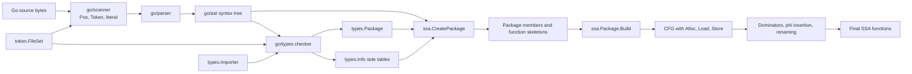
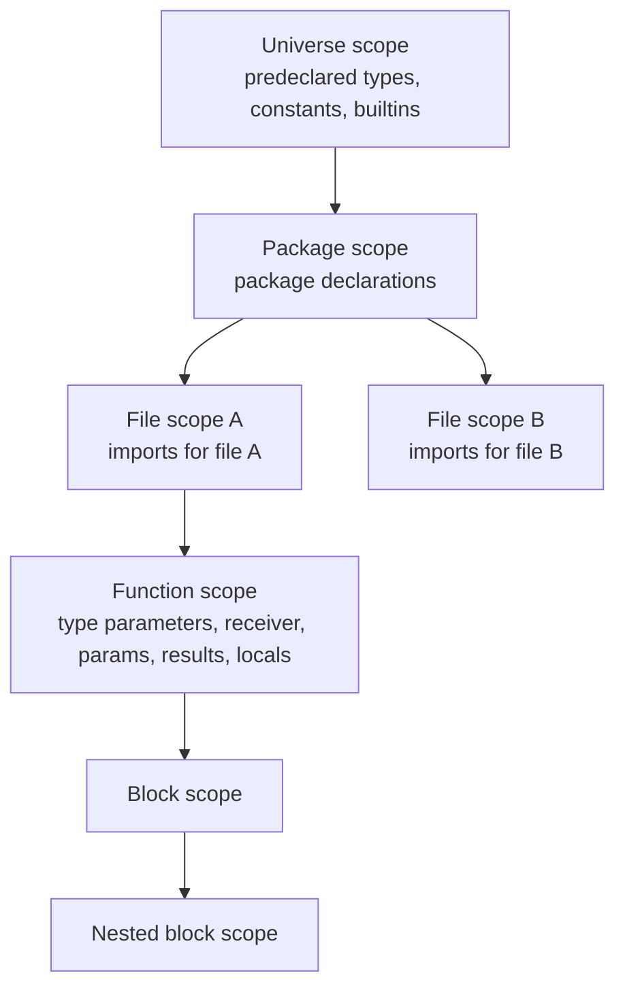
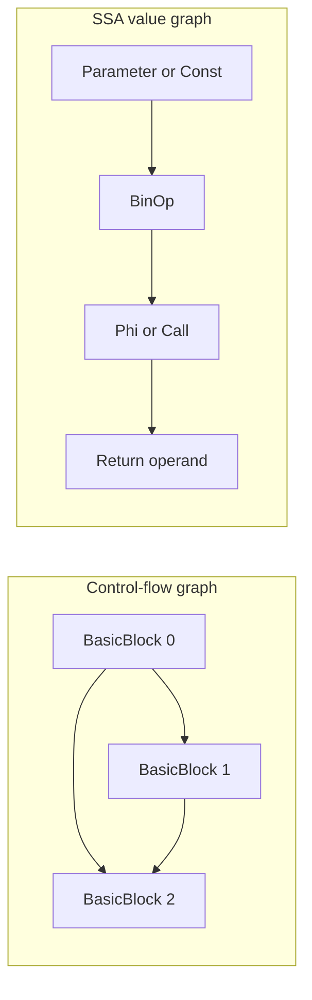
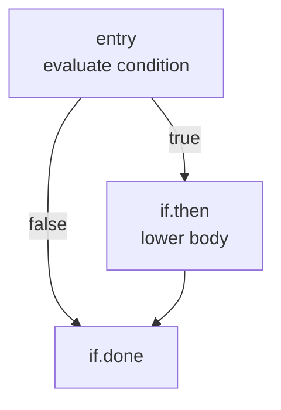
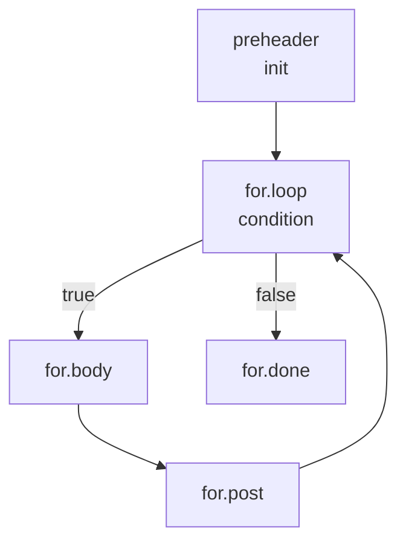
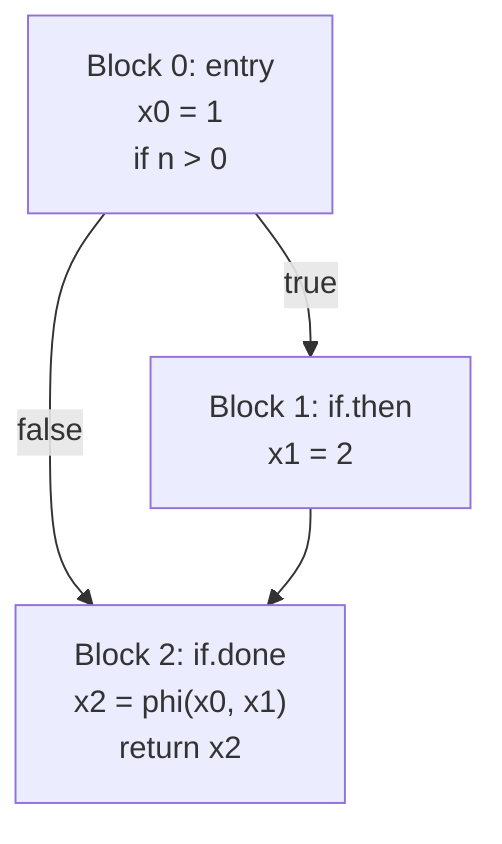

# From Go Source to SSA: `go/token`, `go/parser`, `go/types`, and `x/tools/go/ssa`

This report explains how Go source becomes the static single-assignment (SSA)
representation consumed by Gig. It follows the data in execution order:

```text
source bytes
  -> go/scanner + go/token
  -> go/parser + go/ast
  -> go/types
  -> golang.org/x/tools/go/ssa
  -> Gig's direct SSA interpreter
```

The emphasis is on the hand-off between layers: what each layer produces, what
information is still missing, and which exact structures the next layer reads.

## Version and scope

Gig declares Go 1.23.1 as its language baseline and pins
`golang.org/x/tools v0.30.0` in [`go.mod`](../go.mod#L1-L10). Standard-library
implementation details can vary with the toolchain used to build Gig, so links
to Go internals below use the Go 1.23.1 tag as a reproducible reference. Links
to SSA internals use the exact `x/tools` version selected by the repository.

This report discusses [`golang.org/x/tools/go/ssa`](https://pkg.go.dev/golang.org/x/tools@v0.30.0/go/ssa),
the source-analysis SSA package. It is not the compiler backend IR in
`cmd/compile/internal/ssa`. The analysis SSA deliberately retains Go-level
operations such as interfaces, maps, slices, channels, closures, `defer`, and
`panic`; it is designed for program analysis and interpretation rather than
machine-code generation.

## 1. End-to-end view

Each layer answers a different question.

| Layer | Principal objects | Question answered |
|---|---|---|
| `go/token` | `Token`, `Pos`, `File`, `FileSet`, `Position` | What lexical category is this, and where did it occur? |
| `go/scanner` | `Scanner` | Which `(position, token, literal)` comes next? |
| `go/parser` / `go/ast` | `ast.File`, declarations, statements, expressions | What grammatical structure does the token stream describe? |
| `go/types` | `Package`, `Scope`, `Object`, `Type`, `Info` | What does each syntax occurrence mean, and is the program legal? |
| `x/tools/go/ssa` | `Program`, `Package`, `Function`, `BasicBlock`, `Value`, `Instruction` | What values are computed, and along which control-flow paths? |



Two pieces of information survive almost the entire path:

- A `token.Token` representing an operator may start as `token.ADD`, become
  `ast.BinaryExpr.Op`, and finally become `ssa.BinOp.Op`.
- A `token.Pos` starts in the scanner, is stored on AST nodes and
  `types.Object` values, and is copied to SSA values/instructions for
  diagnostics and source mapping.

## 2. `go/token`: lexical vocabulary and compact source positions

Core API documentation: [`go/token`](https://pkg.go.dev/go/token).

Core source:

- [`token.go`](https://github.com/golang/go/blob/go1.23.1/src/go/token/token.go)
  defines token kinds, keyword lookup, operator predicates, and precedence.
- [`position.go`](https://github.com/golang/go/blob/go1.23.1/src/go/token/position.go)
  defines `Pos`, `Position`, `File`, and `FileSet`.

### 2.1 `Token` is an enum, not a token instance

`token.Token` is an integer enumeration containing categories such as:

```text
Special:      ILLEGAL EOF COMMENT
Identifiers:  IDENT
Literals:     INT FLOAT IMAG CHAR STRING
Operators:    ADD SUB MUL QUO REM LAND LOR EQL LSS GTR ASSIGN DEFINE ...
Delimiters:   LPAREN LBRACK LBRACE COMMA PERIOD SEMICOLON COLON ...
Keywords:     BREAK CASE CHAN CONST CONTINUE DEFAULT DEFER ELSE FOR FUNC ...
```

The token does not carry its spelling or location. The scanner returns those
separately. For example, scanning:

```go
x := a + 2
```

conceptually produces:

```text
(pos0, IDENT,  "x")
(pos1, DEFINE, ":=")
(pos2, IDENT,  "a")
(pos3, ADD,    "+")
(pos4, INT,    "2")
(pos5, SEMICOLON, "\n") // inserted at the newline or EOF
```

The parser uses `Token.Precedence` when grouping binary expressions. This is
why `a + b*c` becomes `a + (b*c)` without the parser needing a separate
precedence table.

### 2.2 `go/scanner` performs lexing

`go/token` defines the vocabulary; [`go/scanner`](https://pkg.go.dev/go/scanner)
performs lexical analysis. Its core implementation is
[`scanner.go`](https://github.com/golang/go/blob/go1.23.1/src/go/scanner/scanner.go).

The scanner:

- decodes UTF-8;
- recognizes identifiers, keywords, numbers, strings, runes, comments,
  operators, and delimiters;
- reports lexical errors;
- records line starts in the associated `token.File`;
- performs Go's automatic semicolon insertion; and
- returns `(token.Pos, token.Token, literal)` for each scanned item.

An inserted semicolon has literal `"\n"`; an explicit semicolon has literal
`";"`. The parser sees both as `token.SEMICOLON` and only uses the literal when
it needs to distinguish them for parsing or diagnostics.

### 2.3 `Pos` is a compact coordinate in a `FileSet`

`token.Pos` does not contain a filename, line, or column. It is a compact
integer coordinate within one `token.FileSet`.

Each registered source file receives a disjoint interval:

```text
file A: [baseA, baseA + sizeA]
file B: [baseB, baseB + sizeB]
```

For a byte offset inside one file:

```text
int(pos) = file.Base() + byteOffset
```

The scanner calls `File.AddLine` as it encounters newlines. Consequently, the
`FileSet` can later translate a compact `Pos` into the larger representation:

```go
type Position struct {
    Filename string
    Offset   int // zero-based byte offset
    Line     int // one-based
    Column   int // one-based byte column
}
```

Important invariants:

- `token.NoPos == 0` means no source position.
- Positions are meaningful only with the `FileSet` that allocated them.
- Comparing positions in the same file is equivalent to comparing byte
  offsets.
- File intervals also make positions from files in one `FileSet` globally
  orderable by file registration order.
- Columns are byte counts, not Unicode code-point counts.
- `//line` directives affect adjusted `Position` values but do not rewrite the
  underlying `Pos` coordinate.

This compact design matters because nearly every AST node has positions. A
small integer on each node is much cheaper than repeating filename, line, and
column strings throughout the tree.

### 2.4 Why one `FileSet` must cross every phase

The same `FileSet` must be passed to the parser, type checker, and SSA program:

```text
parser AST node Pos
     -> go/types object/error Pos
     -> SSA instruction Pos
     -> fset.Position(Pos)
     -> filename:line:column
```

Mixing positions from different file sets may yield plausible integers but
incorrect source locations. Gig creates the shared set at
[`internal/frontend/builder.go:63`](../internal/frontend/builder.go#L63-L67)
and retains it in the resulting frontend `Unit`.

## 3. `go/parser`: tokens become a syntax tree

Core API documentation:
[`go/parser`](https://pkg.go.dev/go/parser) and
[`go/ast`](https://pkg.go.dev/go/ast).

Core source:

- [`parser/interface.go`](https://github.com/golang/go/blob/go1.23.1/src/go/parser/interface.go)
  implements exported entry points such as `ParseFile`.
- [`parser/parser.go`](https://github.com/golang/go/blob/go1.23.1/src/go/parser/parser.go)
  implements recursive-descent grammar routines.
- [`ast/ast.go`](https://github.com/golang/go/blob/go1.23.1/src/go/ast/ast.go)
  defines the syntax node types.

### 3.1 What `ParseFile` does

The public call is:

```go
file, err := parser.ParseFile(fset, filename, src, mode)
```

At a high level it:

1. reads `src` into bytes;
2. calls `fset.AddFile(filename, -1, len(source))`;
3. initializes the internal scanner with that `token.File`;
4. parses the package clause, imports, and declarations;
5. builds an `*ast.File`; and
6. sorts and returns accumulated syntax errors.

The parser owns one-token lookahead state—current position, token, and
literal—and advances it through methods such as `next`, `expect`, and
`expectSemi`.

Gig's wrapper is
[`parseSourceFile`](../internal/frontend/builder.go#L164-L166):

```go
const mode = parser.AllErrors |
    parser.ParseComments |
    parser.SkipObjectResolution
return parser.ParseFile(fset, filename, source, mode)
```

The flags mean:

- `AllErrors`: continue after more syntax errors instead of stopping after the
  normal error threshold;
- `ParseComments`: retain comment groups in the AST; and
- `SkipObjectResolution`: skip the parser's deprecated `ast.Object`
  resolution, leaving semantic name resolution to `go/types`.

### 3.2 Recursive descent and precedence climbing

Declarations, statements, and primary expressions are parsed by routines that
closely follow the language grammar. Binary expressions use precedence
climbing. Conceptually:

```go
func parseBinaryExpr(minPrecedence int) Expr {
    left := parseUnaryExpr()
    for currentToken.Precedence() >= minPrecedence {
        op := currentToken
        advance()
        right := parseBinaryExpr(op.Precedence() + 1)
        left = &ast.BinaryExpr{X: left, Op: op, Y: right}
    }
    return left
}
```

This gives multiplication a tighter subtree than addition and makes
left-associative operators group correctly.

### 3.3 The AST records syntax, not meaning

Consider:

```go
package p

func Choose(n int) int {
    x := 1
    if n > 0 {
        x = 2
    }
    return x
}
```

The central AST shape is:

```text
ast.File
└── ast.FuncDecl "Choose"
    ├── ast.FuncType
    │   ├── parameter n int
    │   └── result int
    └── ast.BlockStmt
        ├── ast.AssignStmt  x := 1
        ├── ast.IfStmt
        │   ├── ast.BinaryExpr  n > 0
        │   └── ast.AssignStmt  x = 2
        └── ast.ReturnStmt  x
```

The declaration, assignment, and return contain three different
`*ast.Ident` pointers whose text is `"x"`. The AST does not establish that
they refer to one variable. Nor does it know the final type of `x`.

Likewise, syntax alone cannot fully disambiguate:

| Syntax | Possible meanings |
|---|---|
| `T(x)` | function call or type conversion |
| `x.f` | package member, field, method value, or method expression |
| `f` | local variable, package declaration, imported declaration, or builtin |
| `1 + 2` | constant expression or part of a context requiring conversion |
| `x[i]` | array/slice/string index, map lookup, or generic instantiation in another context |

Those questions belong to `go/types`.

### 3.4 Error recovery and partial trees

The parser deliberately accepts a somewhat broader language than the final Go
specification. When possible, it records an error, synchronizes at a likely
grammar boundary, inserts an `ast.BadExpr`, `ast.BadStmt`, or `ast.BadDecl`, and
continues. This lets editors and diagnostics inspect the valid portions of an
incomplete file.

Gig does not continue to SSA after a parse error: the frontend wraps and
returns the parse error at
[`builder.go:64-67`](../internal/frontend/builder.go#L64-L67).

### 3.5 Gig's AST preprocessing

Before parsing, Gig adds `package main` when the user supplied only declarations
or functions; see [`wrapPackageMain`](../internal/frontend/builder.go#L169-L174).
After parsing and policy checks, it may inject registered imports directly into
the AST through `injectAutoImports`. Type checking therefore sees the normalized
and policy-approved tree, not necessarily the exact source text submitted by
the caller.

## 4. `go/types`: the AST gains semantic identity

Core API documentation: [`go/types`](https://pkg.go.dev/go/types).

Core source:

- [`types/api.go`](https://github.com/golang/go/blob/go1.23.1/src/go/types/api.go)
  defines `Config`, `Info`, and the exported checker API.
- [`types/check.go`](https://github.com/golang/go/blob/go1.23.1/src/go/types/check.go)
  drives package checking and records semantic results in `types.Info`.
- [`types/resolver.go`](https://github.com/golang/go/blob/go1.23.1/src/go/types/resolver.go)
  collects declarations, imports packages, creates scopes, and orders objects.
- [`types/expr.go`](https://github.com/golang/go/blob/go1.23.1/src/go/types/expr.go)
  checks expressions and computes operands.
- [`types/initorder.go`](https://github.com/golang/go/blob/go1.23.1/src/go/types/initorder.go)
  computes package initialization order.

### 4.1 Inputs and outputs

The high-level API is:

```go
pkg, err := config.Check(packagePath, fset, files, info)
```

Gig uses the incremental form:

```go
pkg := types.NewPackage(pkgPath, file.Name.Name)
checker := types.NewChecker(config, fset, pkg, info)
err := checker.Files([]*ast.File{file})
```

See the actual frontend configuration at
[`builder.go:89-105`](../internal/frontend/builder.go#L89-L105). It supplies:

- Gig's `host.Environment` as the importer;
- explicit 64-bit `types.StdSizes`;
- an error callback that collects all checker diagnostics; and
- the `types.Info` maps needed by later frontend and SSA work.

The primary outputs are:

- `*types.Package`: package identity, scope, imports, and completeness;
- `types.Object` values: declarations and builtins;
- `types.Type` values: semantic types;
- nested `types.Scope` values;
- exact compile-time `constant.Value` values; and
- `types.Info`: maps from AST occurrences to semantic results.

### 4.2 Objects are symbols; types describe them

Important `types.Object` implementations include:

```text
*types.Var       variables, fields, parameters, and results
*types.Func      functions and methods
*types.Const     constants
*types.TypeName  defined types and aliases
*types.PkgName   names introduced by import declarations
*types.Builtin   len, cap, append, make, new, panic, and others
*types.Label     goto/break/continue labels
```

Important `types.Type` implementations include:

```text
*types.Basic       bool, int, string, untyped constants, and so on
*types.Named       a declared named type with an underlying type
*types.Pointer
*types.Array
*types.Slice
*types.Map
*types.Chan
*types.Struct
*types.Interface
*types.Signature   function or method type
*types.Tuple       parameters, results, and multi-valued expressions
*types.TypeParam
*types.Alias
```

The distinction is crucial. An `ast.Ident` is one textual occurrence. A
`types.Object` is the declaration it denotes. A `types.Type` describes the
declaration or expression semantically.

### 4.3 Scope construction and name resolution

Scopes nest approximately as follows:



Name resolution walks outward from the current lexical scope. Shadowed names
are therefore represented by distinct object identities even when they have
the same spelling.

For the `Choose` example:

```text
Ident("x") in x := 1  --Info.Defs--┐
                                  v
                            *types.Var x:int
                                  ^
Ident("x") in x = 2   --Info.Uses--|
Ident("x") in return  --Info.Uses--┘
```

The SSA builder follows that object identity. It does not attempt to match
variables by name.

### 4.4 Checker phases

The implementation interleaves name resolution, constant evaluation, type
deduction, and delayed checks, but the rough package-level sequence is:

1. **Initialize files**: validate package names and establish effective Go
   versions.
2. **Collect objects**: create file scopes, import packages, declare package
   objects, collect methods, and record definitions.
3. **Order declarations**: establish dependencies and detect invalid cycles.
4. **Check package objects**: determine declared types, signatures, constants,
   variable types, and initializers.
5. **Process delayed work**: check function bodies, nested functions, method
   bodies, and delayed constraints.
6. **Finalize types**: complete interfaces, named types, method sets, and
   generic instantiations.
7. **Compute initialization order**: topologically order package variable
   initializers while preserving source order where dependencies do not force
   an order.
8. **Check unused imports and finalize the package**.

The checker can continue after localized errors so it can annotate as much of
the package as possible. However, `ssa.CreatePackage` expects type-checked,
error-free syntax, and Gig stops before SSA if `Checker.Files` returns an
error.

### 4.5 `types.Info` is the AST-to-SSA bridge

`types.Info` is a collection of optional side tables. The checker records only
the maps the caller allocates. Gig allocates its maps in
[`newTypesInfo`](../internal/frontend/builder.go#L282-L290).

| Field | Key -> value | Meaning to SSA |
|---|---|---|
| `Types` | `ast.Expr -> TypeAndValue` | Type, exact constant value, value/type mode, addressability, assignability, comma-ok capability |
| `Defs` | declaring `ast.Ident -> types.Object` | Which object a declaration creates; used for package members and local variables |
| `Uses` | referencing `ast.Ident -> types.Object` | Which variable, function, constant, package, type, or builtin a reference denotes |
| `Implicits` | `ast.Node -> types.Object` | Objects with no explicit declaring identifier, such as unnamed parameters and type-switch variables |
| `Selections` | `ast.SelectorExpr -> *types.Selection` | Field path, method kind, effective receiver, embedded indices, and implicit pointer adjustment |
| `Scopes` | selected `ast.Node -> *types.Scope` | Lexical scope tree, primarily useful to analysis clients |
| `Instances` | generic identifier -> `types.Instance` | Inferred or explicit type arguments and instantiated type, when collected |
| `InitOrder` | ordered `[]*types.Initializer` | Package variable initialization order used by synthetic SSA `init` |

`TypeAndValue` carries more than a type. Its mode distinguishes constants,
variables, ordinary values, type expressions, builtins, map indices, and
comma-ok expressions. Methods such as `IsType`, `IsBuiltin`, `Addressable`, and
`HasOk` let consumers choose the correct lowering without reimplementing the
language rules.

### 4.6 Semantic disambiguation examples

The AST and `types.Info` together determine the SSA operation:

| Syntax | Type-checking fact | SSA lowering |
|---|---|---|
| `T(x)` | `Info.Types[call.Fun].IsType()` | conversion: `Convert`, `ChangeType`, `MakeInterface`, etc. |
| `f(x)` | `f` denotes a callable object/value | `Call` |
| `len(s)` | `Info.Uses[id]` is `*types.Builtin` | builtin call or specialized lowering |
| `x.f` | selection kind is `FieldVal` | `Field` or `FieldAddr` |
| `x.M` | selection kind is `MethodVal` | bound method closure or direct method call |
| `T.M` | selection kind is `MethodExpr` | method-expression wrapper/function |
| `iface.M()` | receiver type is interface | dynamic `invoke` call |
| `1 + 2` | `TypeAndValue.Value` is exact constant 3 | one `ssa.Const`; no runtime `BinOp` |
| `a + b` | nonconstant typed operands | `ssa.BinOp` |
| `m[k]` | operand mode is map index; context requests comma-ok | lookup returning tuple `(value, ok)` |

The key principle is that SSA construction consumes already-proven semantics.
It does not redo overload resolution, method lookup, assignability, or constant
folding.

## 5. Imports: compile-time package identity versus runtime values

`go/types` needs type information for every imported package. It does not need
the package's executable Go values. This separation is particularly important
in Gig.

Gig's [`host.Environment`](../host/host.go#L13-L32) embeds `types.Importer`, so
the same environment serves two roles:

- at compile time it exposes package scopes and object types to `go/types`;
- at runtime it resolves callable functions, variables, constants, types, and
  methods for the interpreter.

The registry adapter delegates compile-time imports through
[`host/registry_bridge.go`](../host/registry_bridge.go#L17-L31). The underlying
[`importer.Importer`](../importer/importer.go#L15-L76):

1. caches packages by import path;
2. locates a registered external package;
3. creates a synthetic `*types.Package`;
4. inserts `*types.Func`, `*types.Var`, `*types.Const`, and
   `*types.TypeName` objects into its scope; and
5. marks the package complete.

The cache is semantically important. Type identity depends on package and
object identity, not just matching package-path and type-name strings. Returning
consistent package objects prevents two imports from accidentally creating
distinct versions of what should be one named type.

## 6. `x/tools/go/ssa`: typed syntax becomes control and data flow

Core package documentation:
[`golang.org/x/tools/go/ssa`](https://pkg.go.dev/golang.org/x/tools@v0.30.0/go/ssa).

Core source at the version used by Gig:

- [`ssa.go`](https://github.com/golang/tools/blob/v0.30.0/go/ssa/ssa.go)
  defines the public IR data model.
- [`create.go`](https://github.com/golang/tools/blob/v0.30.0/go/ssa/create.go)
  implements program/package creation.
- [`builder.go`](https://github.com/golang/tools/blob/v0.30.0/go/ssa/builder.go)
  lowers AST expressions and statements.
- [`func.go`](https://github.com/golang/tools/blob/v0.30.0/go/ssa/func.go)
  manages function construction and finalization.
- [`emit.go`](https://github.com/golang/tools/blob/v0.30.0/go/ssa/emit.go)
  contains instruction-emission helpers.
- [`dom.go`](https://github.com/golang/tools/blob/v0.30.0/go/ssa/dom.go)
  builds dominator trees.
- [`lift.go`](https://github.com/golang/tools/blob/v0.30.0/go/ssa/lift.go)
  promotes eligible memory cells to SSA registers and inserts phi nodes.
- [`mode.go`](https://github.com/golang/tools/blob/v0.30.0/go/ssa/mode.go)
  defines builder flags such as `NaiveForm`, `BareInits`, and
  `SanityCheckFunctions`.

### 6.1 The SSA data model

The major containers are:

```text
ssa.Program
└── ssa.Package
    ├── Members map[string]Member
    │   ├── *ssa.Function
    │   ├── *ssa.Global
    │   ├── *ssa.NamedConst
    │   └── *ssa.Type
    └── functions
        ├── Params
        ├── FreeVars
        ├── Locals
        ├── Blocks
        └── AnonFuncs
```

Inside a function there are two related graphs:



The CFG is represented by `BasicBlock.Preds` and `BasicBlock.Succs`. The data
graph is represented by instruction operands and value referrers.

The interface split is:

- `Value`: something with a type that may be used as an operand;
- `Instruction`: an operation placed in a basic block; and
- `Node`: a value, instruction, or both.

Examples:

| Concrete node | Value? | Instruction? |
|---|---:|---:|
| `Const`, `Parameter`, `FreeVar`, `Global`, named `Function` | yes | no |
| `BinOp`, `Call`, `Phi`, `Alloc`, `Extract`, `MakeInterface` | yes | yes |
| `Store`, `If`, `Jump`, `Return`, `Go`, `Defer`, `Panic` | no | yes |

Every reachable basic block ends with an explicit control-transfer instruction:
`If`, `Jump`, `Return`, or `Panic`. Phi nodes, when present, appear before all
non-phi instructions in the block.

### 6.2 Phase A: `NewProgram` and `CreatePackage`

`ssa.NewProgram(fset, mode)` creates an empty program and retains the shared
`FileSet`. The implementation starts at
[`create.go:35`](https://github.com/golang/tools/blob/v0.30.0/go/ssa/create.go#L35-L45).

`Program.CreatePackage` begins at
[`create.go:196`](https://github.com/golang/tools/blob/v0.30.0/go/ssa/create.go#L196-L279).
It performs the **CREATE phase**:

1. allocate an `ssa.Package`;
2. create its synthetic package initializer, `init`;
3. walk top-level AST declarations;
4. look up each declaration's `types.Object` through `Info.Defs`;
5. create package members; and
6. retain the AST and `types.Info` needed for later body building.

The object-to-member mapping is:

```text
*types.TypeName -> *ssa.Type
*types.Const    -> *ssa.NamedConst containing an *ssa.Const
*types.Var      -> *ssa.Global whose type is a pointer to the variable type
*types.Func     -> *ssa.Function skeleton
```

A function skeleton records its `*types.Func`, signature, source syntax,
position, package, and a deferred build strategy. No body instructions are
created yet.

This separation is what makes recursion straightforward. All package functions
exist and can be referenced before any function body is lowered:

```go
func even(n int) bool { return n == 0 || odd(n-1) }
func odd(n int) bool  { return n != 0 && even(n-1) }
```

Imported packages may be created with types but no syntax:

```go
prog.CreatePackage(importedPkg, nil, nil, true)
```

Those packages supply globals, constants, types, and function signatures but
have no source bodies to build.

### 6.3 Phase B: `Package.Build`

`Package.Build` is idempotent and guarded by `sync.Once`; see
[`builder.go:3161`](https://github.com/golang/tools/blob/v0.30.0/go/ssa/builder.go#L3161-L3181).
The package builder iterates over every function created in the CREATE phase,
including functions synthesized while building methods, wrappers, closures, or
range-over-function support.

Source function bodies enter
[`buildFromSyntax`](https://github.com/golang/tools/blob/v0.30.0/go/ssa/builder.go#L2924-L2965),
which:

1. extracts the receiver, function type, and body from `ast.FuncDecl` or
   `ast.FuncLit`;
2. creates the entry block;
3. creates parameters and result variables;
4. initializes defer support;
5. lowers the body statement tree; and
6. finalizes the function.

After the package is built, the builder clears transient AST and `types.Info`
references from the package. The resulting SSA graph is internally resolved and
no longer needs the syntax tree for ordinary execution or analysis.

### 6.4 Lowering expressions

The central expression dispatcher is
[`builder.expr`](https://github.com/golang/tools/blob/v0.30.0/go/ssa/builder.go#L616-L639).
Its first semantic lookup is effectively:

```go
tv := fn.info.Types[expr]
```

If `tv.Value != nil`, the expression is a compile-time constant and becomes an
`ssa.Const`. Otherwise, addressability and AST kind determine the emitted
instructions.

Representative lowering rules:

| AST expression | Representative SSA |
|---|---|
| `BasicLit` with constant value | `Const` |
| `Ident` | constant, builtin, function, global, parameter, free variable, or load of local address |
| `x + y`, `x < y` | `BinOp` |
| `!x`, `-x`, `^x`, `<-ch`, `*p` | `UnOp` |
| `&x` | address value; may force an allocation to escape |
| `f(args...)` | `Call` |
| `iface.M(args...)` | `Call` whose `CallCommon` represents interface invocation |
| `T(x)` | conversion-family instruction |
| `s[i]` | `Index` or `IndexAddr` depending on addressability/context |
| `m[k]` | `Lookup`, optionally returning a tuple for comma-ok |
| `x.f` | `Field` or `FieldAddr` |
| `x.(T)` | `TypeAssert` |
| `make([]T, n)` | `MakeSlice` |
| `make(map[K]V)` | `MakeMap` |
| `make(chan T)` | `MakeChan` |
| function literal | nested `Function`, possibly `MakeClosure` with `FreeVar` bindings |
| multi-result call | one tuple-valued `Call` followed by `Extract` instructions |

Short-circuit `&&` and `||` are not ordinary `BinOp` instructions. They create
control-flow branches and a phi node at the join because the right operand must
be evaluated conditionally.

### 6.5 Lowering statements and preserving Go evaluation order

The statement dispatcher is
[`builder.stmt`](https://github.com/golang/tools/blob/v0.30.0/go/ssa/builder.go#L2655-L2765).

Representative lowering:

| AST statement | SSA/control-flow result |
|---|---|
| expression statement | evaluate expression for effects |
| variable declaration | allocate/initialize local cell |
| assignment | evaluate addresses and RHS values, then emit stores |
| `if` | condition, then, optional else, and join blocks |
| `for` | header/condition, body, optional post, back-edge, and exit blocks |
| `range` | type-dependent iterator or indexed lowering |
| `switch` | tests and branch blocks |
| `select` | `Select`, extraction, and clause blocks |
| `return` | conversions, `RunDefers`, and `Return` |
| `go f()` | `Go` |
| `defer f()` | `Defer` and recovery support |
| `break`, `continue`, `goto` | `Jump` to the resolved target block |

Assignments require particular care. Go specifies left-to-right evaluation and
parallel assignment semantics. For:

```go
i, a[i] = i+1, 0
```

the old `i` must be used when evaluating `a[i]`, and all required operands must
be evaluated before the writes occur. The builder therefore computes LHS
locations and RHS values first, buffers stores, then emits those stores in the
required order. This is one reason an initial address-based form is simpler and
safer than constructing optimized SSA directly.

### 6.6 Control constructs become a CFG

Structured source constructs disappear into explicit blocks and edges. An
`if` without `else`, for example, becomes:



A conventional `for` loop becomes approximately:



Later block optimization may merge empty or trivial blocks, so the final dump
can be smaller than this direct construction pattern.

## 7. Naive form: source variables initially live in memory

SSA construction begins with a deliberately simple representation. Named
parameters are initially spilled, local variables receive `Alloc` cells, writes
become `Store`, and reads become pointer-dereference `UnOp` instructions.

For:

```go
func Choose(n int) int {
    x := 1
    if n > 0 {
        x = 2
    }
    return x
}
```

the `x`-focused naive form is conceptually:

```text
entry:
    x.addr = alloc int
    store x.addr, 1
    cond = n > 0
    if cond goto then else done

then:
    store x.addr, 2
    jump done

done:
    result = load x.addr
    return result
```

This is easy to build correctly because source assignment maps directly to
memory assignment. Temporary SSA values such as `cond` still have one
definition, but the source variable `x` has not yet been promoted to register
SSA.

Setting the [`NaiveForm`](https://github.com/golang/tools/blob/v0.30.0/go/ssa/mode.go)
builder flag preserves this form for inspection. In the normal mode used by
Gig, function finalization runs the lifting pass.

## 8. Lifting: dominators, phi insertion, and renaming

Function finalization is implemented by
[`finishBody`](https://github.com/golang/tools/blob/v0.30.0/go/ssa/func.go#L350-L394).
Its important sequence is:

```text
optimize blocks
  -> build operand/referrer links
  -> build dominator tree
  -> lift eligible Alloc cells unless NaiveForm
  -> number printed registers
```

### 8.1 Dominance

A block `A` dominates block `B` when every path from the function entry to `B`
passes through `A`. Each reachable block except entry has an immediate
dominator: its nearest strict dominator. These relationships form the dominator
tree constructed in
[`dom.go`](https://github.com/golang/tools/blob/v0.30.0/go/ssa/dom.go#L113-L161).

The dominance frontier of `A` contains join blocks where `A` dominates at
least one predecessor but does not strictly dominate the join. Such joins are
where values defined along different paths may need merging.

### 8.2 Which allocations are liftable?

The pass begins at
[`lift`](https://github.com/golang/tools/blob/v0.30.0/go/ssa/lift.go#L135-L249).
For each local `Alloc`,
[`liftAlloc`](https://github.com/golang/tools/blob/v0.30.0/go/ssa/lift.go#L417-L515)
checks all uses.

An allocation is a lifting candidate when its address is used only by:

- stores into that exact cell;
- loads from that exact cell; and
- optional debug references.

If the address is passed to another operation, stored as a value, returned,
captured in a way that requires shared memory, or otherwise observed, the cell
cannot be replaced safely by independent registers.

The pass collects the blocks containing definitions of the cell, computes their
iterated dominance frontier, and places candidate phi nodes at required joins.

### 8.3 SSA renaming

The renaming pass begins at
[`lift.go:558`](https://github.com/golang/tools/blob/v0.30.0/go/ssa/lift.go#L558-L675).
It traverses the dominator tree in preorder while maintaining a map:

```text
lifted Alloc -> currently dominating SSA Value
```

At each block it:

1. makes newly inserted phi nodes the current values for their variables;
2. removes liftable allocations;
3. replaces each store by changing the current value;
4. replaces each load with the current value;
5. fills phi operands on each outgoing CFG edge; and
6. recursively processes dominated children with path-specific copies of the
   current-value map.

Dead phi nodes and eliminated memory operations are then removed.

### 8.4 Phi-node semantics

After lifting `Choose`, the join block contains:

```text
x.join = phi [entry: 1, then: 2]
```



A phi is not an ordinary runtime function call. On entry to the block it
selects the operand corresponding to the predecessor edge actually taken. In
the API:

```text
phi.Edges[i] corresponds to phi.Block().Preds[i]
```

All phi selections at a block entry are conceptually simultaneous.

### 8.5 The result is hybrid SSA plus explicit memory

Not all mutable state becomes registers:

```text
non-escaping scalar local -> SSA values and phi nodes
address-taken local       -> Alloc, Store, and Load remain
package global            -> address-valued Global plus loads/stores
heap object               -> explicit pointer/aggregate operations
map/channel/slice state   -> high-level stateful SSA instructions
```

Therefore “single assignment” means each SSA `Value` has one definition. It
does not mean Go memory is immutable or that every source variable is renamed
into registers.

## 9. Worked branch example using Gig's actual SSA output

Gig exposes [`DebugDump`](../debug_dump.go#L19-L57), which parses, type-checks,
and builds SSA without executing package initialization.

Source:

```go
func Choose(n int) int {
    x := 1
    if n > 0 {
        x = 2
    }
    return x
}
```

Dump:

```text
func Choose(n int) int:
0:                                                                entry P:0 S:2
    t0 = n > 0:int                                                     bool
    if t0 goto 1 else 2
1:                                                              if.then P:1 S:1
    jump 2
2:                                                              if.done P:2 S:0
    t1 = phi [0: 1:int, 1: 2:int] #x                                    int
    return t1
```

Interpretation:

- `P:n` is the predecessor count and `S:n` is the successor count.
- `t0` is the comparison value, defined exactly once.
- block 0 branches directly to block 2 when the condition is false.
- block 1 represents the assignment `x = 2` but contains no store after
  lifting; its effect is encoded in the phi operand.
- `phi [0: 1, 1: 2]` means use `1` after predecessor block 0 and `2` after
  predecessor block 1.
- `#x` is a diagnostic/debugging comment associating the phi with the source
  variable.
- printed names such as `t0` and `t1` are conveniences, not semantic identity.

## 10. Worked loop example

Source:

```go
func SumTo(n int) int {
    sum := 0
    for i := 0; i < n; i++ {
        sum += i
    }
    return sum
}
```

Dump:

```text
func SumTo(n int) int:
0:                                                                entry P:0 S:1
    jump 1
1:                                                             for.loop P:2 S:2
    t0 = phi [0: 0:int, 2: t3] #sum                                     int
    t1 = phi [0: 0:int, 2: t4] #i                                       int
    t2 = t1 < n                                                        bool
    if t2 goto 2 else 3
2:                                                             for.body P:1 S:1
    t3 = t0 + t1                                                        int
    t4 = t1 + 1:int                                                     int
    jump 1
3:                                                             for.done P:1 S:0
    return t0
```

The loop header merges initial values from block 0 with loop-carried values
from the back-edge block 2:

```text
sum.current = phi(0, sum.next)
i.current   = phi(0, i.next)

sum.next = sum.current + i.current
i.next   = i.current + 1
```

This is the SSA representation of the recurrence that source-level mutation
expresses.

## 11. Package initialization

Every SSA package receives a synthetic `init` function during CREATE. In normal
`x/tools/go/ssa` mode it can:

- guard against repeated initialization;
- call imported-package initializers;
- evaluate package variables in `types.Info.InitOrder`; and
- call source-declared `init` functions.

Gig constructs its program with
[`ssa.SanityCheckFunctions | ssa.BareInits`](../internal/frontend/builder.go#L116-L124).
`SanityCheckFunctions` validates built function invariants. `BareInits` omits
the initialization guard and imported-package init calls, which suits Gig's
explicit host-package boundary while retaining source-package variable and
declared-init construction.

`CreatePackage` is called first for each direct import with no syntax, then for
the interpreted source package with its AST and `types.Info`:

```go
for _, imported := range pkg.Imports() {
    prog.CreatePackage(imported, nil, nil, true)
}
ssaPkg := prog.CreatePackage(pkg, files, info, false)
ssaPkg.Build()
```

## 12. Minimal standalone construction recipe

The direct parser/types/SSA sequence is:

```go
fset := token.NewFileSet()

file, err := parser.ParseFile(
    fset,
    "p.go",
    source,
    parser.ParseComments|parser.SkipObjectResolution,
)
if err != nil {
    return err
}
files := []*ast.File{file}

info := &types.Info{
    Types:        make(map[ast.Expr]types.TypeAndValue),
    Instances:    make(map[*ast.Ident]types.Instance),
    Defs:         make(map[*ast.Ident]types.Object),
    Uses:         make(map[*ast.Ident]types.Object),
    Implicits:    make(map[ast.Node]types.Object),
    Selections:   make(map[*ast.SelectorExpr]*types.Selection),
    Scopes:       make(map[ast.Node]*types.Scope),
    FileVersions: make(map[*ast.File]string),
}

config := &types.Config{Importer: importer.Default()}
pkg, err := config.Check("example/p", fset, files, info)
if err != nil {
    return err
}

prog := ssa.NewProgram(fset, ssa.SanityCheckFunctions)
for _, imported := range pkg.Imports() {
    prog.CreatePackage(imported, nil, nil, true)
}

ssaPkg := prog.CreatePackage(pkg, files, info, true)
ssaPkg.Build()
```

For real module-aware analysis tools, prefer
[`golang.org/x/tools/go/packages`](https://pkg.go.dev/golang.org/x/tools@v0.30.0/go/packages)
plus `ssautil.Packages`. `go/packages` handles build constraints, modules, test
variants, generated files, package discovery, and dependency loading. Gig uses
the lower-level path intentionally because it compiles one controlled,
in-memory source unit against a custom registry.

## 13. Important invariants and common misconceptions

### The AST is not typed

Parsing success establishes grammatical structure, not type correctness.
`parser.ParseFile` can accept constructs that `go/types` later rejects.

### Identifier strings are not symbol identity

Two identifiers named `x` may denote different variables because of shadowing.
`types.Object` identity is authoritative.

### A `CallExpr` is not necessarily a call

The same AST shape represents `f(x)` and `T(x)`. `Info.Types[Fun].IsType()`
distinguishes conversion from invocation.

### Constants are often absent from runtime SSA operations

`go/types` folds exact constants before SSA. `1 + 2` can become a single
constant `3`; it need not create a `BinOp`.

### Phi nodes merge control-flow values, not arbitrary data

Each phi operand is tied to one predecessor edge. Reordering a block's
predecessors without correspondingly reordering phi edges changes program
meaning.

### SSA does not eliminate all memory

Address-taken locals, globals, and heap objects remain explicit memory. The IR
is SSA for values plus stateful Go operations.

### Register names are not stable semantics

Names such as `t0` are assigned after construction to make dumps readable.
Analyses and interpreters must use object/value identity and graph topology, not
printed names.

### Source positions are approximate mappings

SSA `Pos` methods identify the source token most closely associated with an
operation. Transformations, implicit conversions, synthetic functions, and
phi nodes may have no exact one-to-one source expression.

## 14. Gig-specific core-code map

| Concern | Core code |
|---|---|
| Public build entry point | [`gig.Build`](../gig.go#L59-L84) |
| Frontend contract | [`internal/frontend/frontend.go`](../internal/frontend/frontend.go#L1-L58) |
| Complete parse/type-check/SSA pipeline | [`defaultBuilder.Build`](../internal/frontend/builder.go#L42-L131) |
| Parser mode | [`parseSourceFile`](../internal/frontend/builder.go#L164-L166) |
| Source package auto-wrap | [`wrapPackageMain`](../internal/frontend/builder.go#L169-L174) |
| Type-checker configuration | [`builder.go`](../internal/frontend/builder.go#L89-L105) |
| Collected `types.Info` maps | [`newTypesInfo`](../internal/frontend/builder.go#L282-L290) |
| Host compile/runtime boundary | [`host.Environment`](../host/host.go#L13-L32) |
| Registry-to-`types.Package` importer | [`importer/importer.go`](../importer/importer.go#L15-L135) |
| SSA program/package creation | [`builder.go`](../internal/frontend/builder.go#L116-L124) |
| Human-readable SSA output | [`DebugDump`](../debug_dump.go#L19-L57) |
| Frontend result passed to interpreter | [`frontend.Unit`](../internal/frontend/frontend.go#L51-L58) |
| Interpreter program construction | [`internal/interp/engine.go`](../internal/interp/engine.go) |
| SSA instruction planning | [`internal/interp/plan.go`](../internal/interp/plan.go) |
| SSA execution loop and operations | [`internal/interp/frame.go`](../internal/interp/frame.go), [`ops.go`](../internal/interp/ops.go) |

## 15. Recommended source-reading order

For a code-level study, this order minimizes backtracking:

1. Go [`token.go`](https://github.com/golang/go/blob/go1.23.1/src/go/token/token.go)
   and [`position.go`](https://github.com/golang/go/blob/go1.23.1/src/go/token/position.go).
2. Go [`scanner.go`](https://github.com/golang/go/blob/go1.23.1/src/go/scanner/scanner.go).
3. Go parser [`interface.go`](https://github.com/golang/go/blob/go1.23.1/src/go/parser/interface.go)
   and [`parser.go`](https://github.com/golang/go/blob/go1.23.1/src/go/parser/parser.go).
4. Go types [`api.go`](https://github.com/golang/go/blob/go1.23.1/src/go/types/api.go),
   [`resolver.go`](https://github.com/golang/go/blob/go1.23.1/src/go/types/resolver.go),
   [`check.go`](https://github.com/golang/go/blob/go1.23.1/src/go/types/check.go), and
   [`expr.go`](https://github.com/golang/go/blob/go1.23.1/src/go/types/expr.go).
5. `x/tools/go/ssa` [`ssa.go`](https://github.com/golang/tools/blob/v0.30.0/go/ssa/ssa.go)
   and [`create.go`](https://github.com/golang/tools/blob/v0.30.0/go/ssa/create.go).
6. SSA [`builder.go`](https://github.com/golang/tools/blob/v0.30.0/go/ssa/builder.go),
   starting with `expr`, `stmt`, and `buildFromSyntax`.
7. SSA [`func.go`](https://github.com/golang/tools/blob/v0.30.0/go/ssa/func.go),
   followed by [`dom.go`](https://github.com/golang/tools/blob/v0.30.0/go/ssa/dom.go)
   and [`lift.go`](https://github.com/golang/tools/blob/v0.30.0/go/ssa/lift.go).
8. Gig's [`internal/frontend/builder.go`](../internal/frontend/builder.go#L42-L131)
   to see those APIs composed into one in-memory compilation pipeline.
9. Gig's [`DebugDump`](../debug_dump.go#L19-L57) and interpreter implementation
   to observe and execute the resulting IR.

## 16. Compact mental model

The whole pipeline can be remembered as four progressively stronger
statements about the program:

```text
go/token:
    "This is the + token at compact source position p."

go/parser:
    "This + is the root of a binary-expression syntax node."

go/types:
    "Both operands are compatible integers; this expression has type int."

x/tools/go/ssa:
    "In this basic block, define one int value from these two operand values."
```

For variables:

```text
go/parser:
    "These are three identifier nodes whose spelling is x."

go/types:
    "All three denote this exact *types.Var object."

x/tools/go/ssa:
    "Use the currently dominating value for that object, merge path-specific
     values with phi nodes, or preserve an address if the object cannot be
     lifted safely."
```
